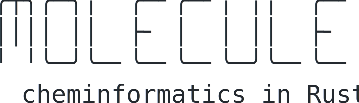

<p align="center">
  <picture>
    <source media="(prefers-color-scheme: dark)" srcset="./assets/molecules-logo-dark.svg">
    
  </picture>
</p>

`molecules` is a pre-1.0 pure-Rust backend for both small-molecule and
macromolecular structure work. This project is human-architected and AI-coded.
The cheminformatic capabilities are bundled into features, which are
parity-checked against established codebases - RDKit for small molecules and
Biopython for macromolecules.

For feature release status, validation evidence, and the generated dependency
graph, see the [rendered feature dashboard](https://choutkaj.github.io/molecules/)
or inspect the generated [dashboard source](features/DASHBOARD.html).

> [!NOTE]
> The `0.x` series follows Cargo semver: breaking API changes are released in a
> new minor version. Focused facade modules are the supported public surface;
> implementation modules remain private.


## Basic Usage

The public API is organized around a small prelude plus focused format and workflow modules. Parsing, sanitization, validation, and writing are separate steps so callers can choose when interpretation happens.

### Small molecules

Use `SmallMolecule` for the common small-molecule path. Parsing and interpretation
do not sanitize; `sanitize` installs chemistry-derived state such as valence,
rings, and aromaticity.

```rust
use molecules::prelude::*;

fn main() -> Result<(), Box<dyn std::error::Error>> {
    let mut mol = SmallMolecule::from_smiles("c1ccccc1O")?;
    mol.sanitize()?;

    assert_eq!(mol.atom_count(), 7);
    assert_eq!(mol.bond_count(), 7);

    let canonical = mol.to_canonical_smiles()?;
    println!("canonical SMILES: {canonical}");

    Ok(())
}
```

The equivalent staged path keeps the raw format document available:

```rust
let document = molecules::smiles::parse_str("[Na+].[Cl-]")?;
assert_eq!(document.component_token_ranges().len(), 2);
let interpreted = molecules::smiles::interpret(&document)?;
let salt = interpreted.molecule();
assert_eq!(salt.atom_count(), 2);
assert_eq!(salt.graph().connected_components().len(), 2);
# Ok::<(), Box<dyn std::error::Error>>(())
```

The dots describe disconnected graph components; the SMILES record still
asserts one `SmallMolecule`.

### Substructure queries

`QueryGraph` is syntax-independent. The bounded SMARTS frontend creates one,
and the separate substructure matcher consumes it. Target perception remains an
explicit caller step.

```rust
use molecules::small::SmallMolecule;

fn main() -> Result<(), Box<dyn std::error::Error>> {
    let target = SmallMolecule::from_smiles_sanitized("CC(=O)O")?;
    let query = molecules::query::parse_smarts("[C](=O)[O;H1]")?;
    let matches =
        molecules::substructure::find_substructure_matches(target.graph(), &query)?;

    assert_eq!(matches.len(), 1);
    Ok(())
}
```

Unsupported SMARTS primitives return structured errors; they are never
silently approximated. Programmatic queries use the same `QueryGraphBuilder`,
atom/bond predicate, and matching APIs without passing through SMARTS.

### Molecular modelling

The modelling layer creates a fixed `ModelTopology` from distinct Small and
Macro molecule instances. Local IDs survive insertion and become unambiguous
when qualified by the returned `MoleculeInstanceId`.

```rust
use molecules::core::{Atom, BondOrder, Conformer, Element, Molecule, Point3};
use molecules::modeling::potential::{HarmonicBondParameter, HarmonicBondPotential};
use molecules::modeling::{minimize, InstanceBondId, MinimizeOptions, Model};
use molecules::small::SmallMolecule;
use molecules::units::{ANGSTROM, MODEL_FORCE_CONSTANT_UNIT, Quantity};

fn main() -> Result<(), Box<dyn std::error::Error>> {
    let mut graph = Molecule::new();
    let carbon = graph.add_atom(Atom::new(Element::from_symbol("C").unwrap()));
    let oxygen = graph.add_atom(Atom::new(Element::from_symbol("O").unwrap()));
    let source_bond = graph.add_bond(carbon, oxygen, BondOrder::Single)?;

    let mut conformer = Conformer::new(ANGSTROM)?;
    conformer.set_position(
        carbon,
        Quantity::new(Point3::new(0.0, 0.0, 0.0), ANGSTROM),
    )?;
    conformer.set_position(
        oxygen,
        Quantity::new(Point3::new(2.0, 0.0, 0.0), ANGSTROM),
    )?;
    let conformer = graph.add_conformer(conformer)?;
    let molecule = SmallMolecule::from_graph(graph);

    let mut builder = Model::builder();
    let instance = builder.add_small_molecule(&molecule, conformer)?;
    let model = builder.build()?;
    let bond = InstanceBondId::new(instance, source_bond);
    let mut potential = HarmonicBondPotential::new(
        &model,
        [HarmonicBondParameter::new(
            bond,
            1.2 * ANGSTROM,
            100.0 * MODEL_FORCE_CONSTANT_UNIT,
        )],
    )?;
    let minimized = minimize(&model, &mut potential, MinimizeOptions::default())?;

    println!(
        "final energy: {} {}",
        minimized.final_energy.value(),
        minimized.final_energy.unit()
    );
    Ok(())
}
```

`add_macro_molecule` can be used on the same builder. The stored instance exposes
typed Small/Macro accessors and a qualified hierarchy view whose atom-site
lookups return `InstanceAtomId`.

### Macromolecules

Use the `mmcif` facade for multi-entity structure input. Parsing preserves the
mmCIF document; interpretation selects one coordinate model and produces one
`Model` containing distinct molecule instances.

```rust
use molecules::mmcif::{
    self, MmcifInterpretOptions, MmcifParseOptions, MmcifWriteOptions,
};

fn main() -> Result<(), Box<dyn std::error::Error>> {
    let input = r#"
data_demo
loop_
_entity.id
_entity.type
1 polymer
loop_
_atom_site.type_symbol
_atom_site.label_atom_id
_atom_site.label_comp_id
_atom_site.label_asym_id
_atom_site.label_entity_id
_atom_site.auth_seq_id
_atom_site.Cartn_x
_atom_site.Cartn_y
_atom_site.Cartn_z
C C1 GLY A 1 1 0.0 0.0 0.0
"#;

    let document = mmcif::parse_str(input, MmcifParseOptions::default())?;
    let interpreted = mmcif::interpret(&document, MmcifInterpretOptions::default())?;
    let macro_instance = interpreted
        .model()
        .topology()
        .molecules()
        .next()
        .expect("one polymer molecule")
        .1;
    let macro_mol = macro_instance.macro_molecule().expect("macro instance");

    println!("atoms: {}", interpreted.model().atom_count());
    println!("selected model: {:?}", interpreted.report().selected_model());

    let output = mmcif::write(interpreted.model(), MmcifWriteOptions::default())?;
    assert!(output.starts_with("data_model"));

    Ok(())
}
```

Protein secondary structure is an explicit, read-only analysis of that selected
coordinate snapshot:

```rust
let assignment = molecules::dssp::assign(
    interpreted.model(),
    molecules::dssp::DsspOptions::default(),
)?;
for residue in assignment.residues() {
    println!("{} {}", residue.key(), residue.secondary_structure().code());
}
# Ok::<(), Box<dyn std::error::Error>>(())
```

The DSSP result is not cached in the model. Re-run assignment explicitly after
changing coordinates.

## License

`molecules` is available under the MIT license.
