<div style="text-align: center;">
    
</div>

<p align="center">
  
</p>

<pre style="line-height: 1; font-family: monospace;">
╭┬╮╭─╮╷  ╭─╴╭─╴╷ ╷╷  ╭─╴╭─╮
││││ ││  ├╴ │  │ ││  ├╴ ╰─╮
╵ ╵╰─╯╰─╴╰─╴╰─╴╰─╯╰─╴╰─╴╰─╯
  cheminformatics in Rust
</pre>

`molecules` is an AI-coded cheminformatics backend for small molecules and macromolecules written in pure Rust. The repo is organized around feature-scoped development: every meaningful capability is treated as a feature and is validated against established codebases (RDKit and Biopython).

## Current scaffold

- Cargo workspace with `molecules` and `xtask` crates.
- Minimal pure Rust molecule data model skeleton.
- Architecture, roadmap, agent rules, and contribution docs.
- Feature registry, generated dashboard, and feature templates.
- Codex skills for feature work and independent feature review.
- Reference-validation directories for RDKit and Biopython.

## Common commands

```bash
cargo test --workspace
cargo xtask dashboard
cargo xtask dashboard --check
cargo xtask skills --check
cargo xtask validate --feature io.smiles.parse --corpus tiny
cargo xtask validate --feature all --corpus all
```

The `cargo xtask` alias is defined in `.cargo/config.toml`.

## License

License is intentionally not selected yet. Choose an open-source license before public release.
