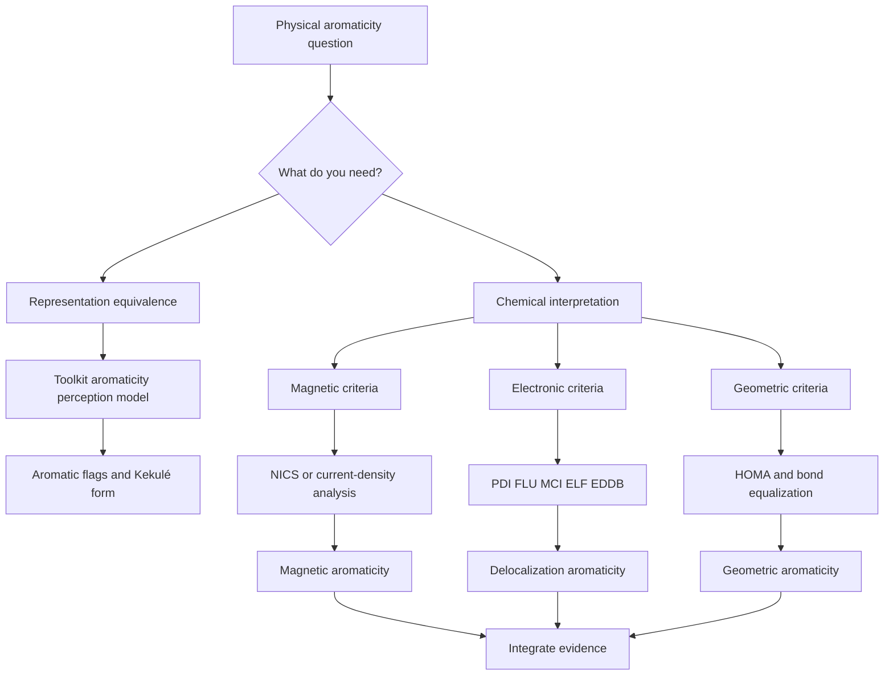
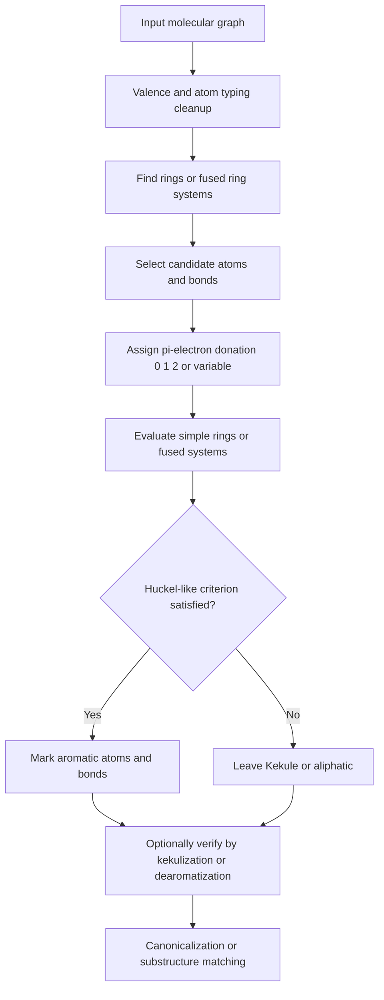
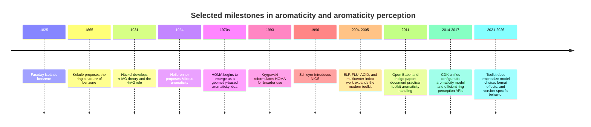

# Aromaticity and Aromaticity Detection in Cheminformatics

## Executive summary

Aromaticity is simultaneously a chemical phenomenon, a family of quantum-chemical diagnostics, and a pragmatic data model used by cheminformatics toolkits to normalize resonance forms and make substructure search, canonicalization, depiction, and fingerprinting tractable. Those three layers do **not** coincide perfectly. Modern reviews emphasize that aromaticity has no single universally accepted observable or operator; instead, chemists use a cluster of energetic, magnetic, structural, and electronic signatures, which often agree for simple monocyclic π-systems but can diverge for heterocycles, fused systems, organometallics, excited states, and strongly distorted rings. That conceptual fuzziness is not a defect of cheminformatics alone; it is intrinsic to the concept. citeturn29view1turn29view3turn14search6

For cheminformatics, the key practical point is that **“aromaticity perception” is an algorithmic convention**, not a direct physical measurement. Toolkits choose a ring set, define which atoms may donate 0/1/2 π-electrons, decide whether exocyclic double bonds “steal” electrons, determine whether fused perimeters count, and then assign aromatic atom/bond flags if a chosen Hückel-like criterion is satisfied. Different choices yield different aromatic SMILES, different canonical strings, different fingerprints, and sometimes different substructure-search results. The CDK documentation and the RDKit/Open Babel/OEChem manuals are explicit that aromaticity is model-dependent and configurable, even within a single toolkit. citeturn16search0turn15view3turn7view0turn8view0turn11view0

Across major toolkits, there is a broad split between **Daylight-like graph models** and **toolkit-specific variants**. RDKit’s default model uses fused-ring electron counting, supports aromatic Se and Te, excludes some radical heteroatoms, and limits fused aromaticity processing to candidate fused systems whose members are each at most 24 atoms for efficiency. Open Babel uses a single model “close to Daylight,” with aromaticity stored as flags separate from bond order and lazily reperceived when needed. CDK exposes the underlying design most transparently: electron-donation models are separate from cycle-finding strategies, so “aromaticity” is literally the composition of those two choices. OEChem provides multiple formal models—OpenEye, Daylight, Tripos, MDL, and MMFF—through one API, while ChemAxon exposes basic, general, and loose aromatization modes; Indigo exposes basic and generic models plus configurable dearomatization verification. citeturn9view0turn9view4turn8view0turn8view2turn16search0turn16search1turn11view0turn11view3turn24view0turn24view2turn22search2turn21view0

For **physical aromaticity assessment**, no single index is sufficient. NICS and related magnetic probes are convenient and powerful, but they measure magnetic aromaticity and can be contaminated by local σ-effects and by neighboring rings. HOMA is cheap and interpretable, but it is parameterized and can mistake bond equalization for aromaticity. PDI and FLU are useful electron-delocalization measures derived from delocalization indices; PDI is largely restricted to six-membered rings, while FLU is broader but still reference-sensitive. Multicenter indices such as MCI are among the most conceptually satisfying electronic measures, but their cost grows very rapidly with ring size; for macrocycles, AV1245 was proposed as a linear-scaling alternative. ACID and GIMIC/ring-current maps are best viewed as high-information visualization/integration tools rather than single-number indices. citeturn31view1turn32view4turn37view3turn31view2turn32view1turn32view2turn32view3turn31view3turn35view3turn35view2

The most robust workflow, therefore, is **two-tiered**. Use a toolkit-specific aromaticity model for representation and search, but do not infer physical aromaticity from the toolkit’s aromatic flags. For chemical interpretation, validate contentious motifs—especially heteroaromatics with exocyclic carbonyls, fused non-benzenoids, radicals, charged rings, and organometallics—using at least one magnetic criterion and one electronic or geometric criterion, and compare against a benzene-like reference only when the index supports that comparison. If a toolkit’s exact behavior is part of the scientific claim, record the toolkit name, version, aromaticity model, file format, and any non-default parameters. citeturn24view3turn11view2turn17view1turn25view0turn21view0

## Foundations, definitions, and controversies

The classical foundation is Hückel’s π-molecular-orbital picture: planar cyclic conjugated monocyclic systems with \(4n+2\) π-electrons are aromatic, while \(4n\) systems are antiaromatic. That rule works strikingly well for benzene-like rings, but modern reviews stress that it is neither a full definition of aromaticity nor universally valid for polycyclic, three-dimensional, organometallic, or excited-state systems. Contemporary commentary describes aromaticity as broader, more actively debated, and in some respects “fuzzier” than ever, precisely because powerful new descriptors reveal that different aspects of aromaticity need not track each other perfectly. citeturn29view1turn29view3turn14search6turn36search11

Möbius aromaticity extends the orbital-topology idea to twisted cyclic systems. Heilbronner’s proposal reversed the Hückel counting pattern for a Möbius topology, making \(4n\) electron counts aromatic in the idealized case. Later reviews emphasize that real molecules complicate the clean textbook picture because topology, geometry, and state dependence all matter. In practice, Möbius aromaticity is usually assessed with the same basket of magnetic, geometric, and electronic criteria used elsewhere, not by electron count alone. citeturn36search2turn36search10turn36search7

Resonance language remains useful, but it is descriptive rather than fundamental. Aromaticity is best understood as **cyclic electron delocalization**—a form of multicenter bonding—rather than as literal oscillation between Kekulé structures. The IUPAC-style description of delocalization as redistribution of valence electron density relative to localized reference models captures this better than simplistic alternating-bond drawings do. Modern reviews of electronic aromaticity indices make the same point explicitly: aromaticity is deeply connected to multicenter electron sharing, and different indices attempt to quantify different shadows of that multicenter bonding. citeturn37view3turn31view0turn32view3

Magnetic criteria arise from induced ring currents under an external magnetic field. Aromatic systems tend to sustain a **net diatropic** ring current; antiaromatic systems tend to show **net paratropic** behavior. This underlies NICS, ACID, and GIMIC analyses. But magnetic aromaticity is still only one facet of aromaticity, not the whole concept. The modern NICS review is especially clear on this point: a NICS value is simply the negative magnetic shielding at a chosen point, and its interpretation as aromatic or antiaromatic depends on context. citeturn31view1turn32view4turn35view3turn35view2turn37view2

Geometric criteria focus on bond-length equalization and planarity. HOMA is the best-known representative: it rewards convergence of ring-bond lengths toward an “optimal aromatic” reference. Electronic criteria instead quantify electron sharing or localization, for instance through delocalization indices, FLU, PDI, MCI, or ELF-based descriptors. Reviews repeatedly show that those families correlate well in many ordinary aromatic rings, but not universally. That is why claims such as “aromatic because NICS is negative” or “nonaromatic because HOMA is modest” are methodologically weak outside simple benchmark systems. citeturn37view3turn32view0turn32view2turn32view3turn35view1

A useful way to organize the controversy is this: there are at least three defensible positions. One treats aromaticity as a **multidimensional family resemblance** concept; another insists that a molecule should only be called aromatic when several criteria align; a third, argued forcefully in recent philosophical/theoretical reviews, holds that aromaticity is a **theoretical notion** whose meaning depends on the model, so it is a mistake to define it directly by several different experimental observables at once. Cheminformatics, unsurprisingly, adopts an even narrower operational stance: aromaticity is a model chosen for representation. citeturn29view3turn29view1turn15view3

## Computational aromaticity indices

The table below compares the most widely used indices and visualization methods in the context of *practical computation*. “Typical threshold” is intentionally conservative: where the literature does not support a robust universal cutoff, it is marked as system-dependent or unspecified. citeturn31view1turn37view3turn32view1turn32view2turn32view3turn35view1turn31view3turn35view3turn35view2

| Index or method | Core definition | Typical interpretation | Strengths | Weaknesses | Practical cost |
|---|---|---|---|---|---|
| **NICS** | \( \mathrm{NICS}(\mathbf r) = -\sigma_{\mathrm{iso}}(\mathbf r)\); component forms use \(-\sigma_{zz}\) or π-only decompositions. citeturn32view4turn31view1 | More negative usually means more **magnetic** aromaticity; positive suggests antiaromaticity. Universal cutoff: **unspecified**. | Easy to compute; many variants; useful local probe. citeturn31view1 | Sensitive to probe placement, σ-contamination, neighboring currents; measures magnetic aromaticity only. citeturn31view1turn37view3 | Low-to-moderate; dominated by shielding calculation at chosen QM level. |
| **HOMA** | \( \mathrm{HOMA}=1-\frac{\alpha}{n}\sum_i (R_i-R_{\mathrm{opt}})^2 \). citeturn37view3 | Often: near 1 aromatic, near 0 nonaromatic, negative antiaromatic/distorted; exact cutoffs depend on parametrization. | Very cheap once geometry is known; intuitive. citeturn37view3turn30search6 | Parameterized; can overread bond equalization as aromaticity; less transferable across element sets and reaction paths. citeturn32view0turn32view2turn33search7 | Very low; \(O(n)\) in the number of ring bonds after geometry optimization. |
| **PDI** | Average delocalization index over para-related atoms in a six-membered ring. citeturn37view3turn32view1 | Benzene is about 0.10; much smaller values imply weaker local aromaticity. Universal cutoff: **not robust**. | Useful local index for benzenoid rings and Clar-type analysis. citeturn32view1turn37view3 | Largely restricted to 6-membered rings; heteroatom dependence can be misleading. citeturn32view1turn37view3 | Moderate; requires QTAIM-like delocalization indices. |
| **FLU** | Weighted fluctuation of adjacent-bond delocalization relative to a reference aromatic pattern. citeturn37view3turn31view2 | Lower is more aromatic; benzene gives 0. | Works for rings of various sizes; often good for ordinary ground-state heteroaromatics. citeturn31view2turn37view3 | Reference-sensitive; can fail along reaction paths and for some unusual systems. citeturn32view2turn32view0 | Moderate. |
| **MCI** | Multicenter electron-delocalization measure; conceptually, permutation-averaged ring multicenter sharing. citeturn32view3turn37view3 | Larger means more aromatic, but raw values are size-dependent; universal thresholds are **not recommended**. | Broadly applicable to organic and inorganic rings; often one of the most informative electronic measures. citeturn32view3turn37view3 | Cost rises very rapidly with ring size; numerical/size-extensivity issues motivate normalization or alternatives. citeturn32view3turn37view3 | High to very high; grows rapidly, often effectively prohibitive for macrocycles. |
| **AV1245** | Average of selected 4-center MCIs along the ring. citeturn31view3 | Larger means more aromatic. | Designed for large rings; linear scaling in ring size. citeturn31view3 | Approximate; not a drop-in replacement for full MCI in every case. | Low-to-moderate relative to MCI. |
| **ELF-based scales** | Aromaticity from ELF topology, often via average bifurcation values of σ and/or π contributions. citeturn35view1 | No universal scalar threshold. | Connects directly to localization/delocalization picture; can separate σ and π effects. citeturn35view1 | Requires topological analysis; interpretation less standardized than NICS/HOMA. | Moderate. |
| **ACID** | Visualization of anisotropy of induced current density. citeturn35view3 | Continuous current loops support aromatic delocalization; direction distinguishes dia-/paratropic response. | Excellent qualitative insight; works for ground states, transition states, organometallics. citeturn35view3 | Not a single scalar; interpretation depends on setup and visualization. | High. |
| **GIMIC / ring-current maps** | Current-density integration under a magnetic field, often yielding ring-current strength. citeturn35view2turn37view2 | Net diatropic current suggests aromaticity; net paratropic suggests antiaromaticity. Scalar cutoffs are context-dependent. | Quantitative current strengths; can separate local vs global pathways. citeturn34search10turn35view2 | Expensive; requires careful integration-plane choice and interpretation. citeturn35view2 | High to very high. |

A few practical points matter more than memorizing index acronyms. First, **NICS is not one thing**. NICS(0), NICS(1), tensor-component analyses, and π-only decompositions answer slightly different questions, and the modern best-practice literature explicitly warns against treating a single NICS number as a universal aromaticity truth. Second, **reference-based indices** such as HOMA and FLU can be very useful for ground-state organic rings, but they become less trustworthy when comparing atom types, heavily distorted structures, or reaction-coordinate changes. Third, when ring size is large, **MCI becomes the bottleneck**, which is exactly why AV1245 was introduced. citeturn31view1turn32view0turn32view2turn32view3turn31view3

For ordinary six-membered benzenoids, a workable consensus is: use HOMA for a cheap structural screen, PDI or FLU for local electronic corroboration, and NICS or a current-density method if magnetic evidence is needed. For macrocycles, porphyrinoids, Möbius candidates, and fused non-benzenoids, move quickly to current-density analysis and multicenter/electronic measures; simple Hückel counting and single-point NICS are often too fragile. citeturn32view1turn32view2turn32view3turn35view3turn37view2

## Algorithmic perception in cheminformatics

Most practical aromaticity-perception engines follow the same abstract recipe:

At the graph level, the main design choices are:

**Ring-set selection.** A toolkit may examine an SSSR-like basis, a larger but still bounded canonical cycle family, all simple cycles up to a limit, or fused systems built from simple cycles. This choice is not cosmetic. Azulene-like systems and complex fused frameworks can change outcome depending on whether only “individual” rings or the fused perimeter is examined. CDK’s docs are unusually explicit: cycle choice and electron-donation model jointly define aromaticity. They also note that finding all cycles can become exponential in complex fused systems, so fallback strategies such as `Cycles.relevant()` are needed. citeturn17view1turn17view0turn15view3

**Electron counting.** Most toolkit models reduce the atom’s contribution to one of a few discrete values: 0, 1, 2, sometimes “vacant orbital,” and occasionally “whatever makes the ring aromatic” for dummy/query atoms. RDKit’s documentation gives concrete examples: pyridine-like aromatic N contributes 1, pyrrolic [nH] contributes 2, exocyclic carbonyls contribute 0 to the ring atom whose electron is “stolen,” and dummy atoms may contribute 0/1/2 as needed. CDK describes its algorithm even more abstractly as assigning each atom a potential donation of \(-1, 0, 1, 2\), then checking candidate cycles against \(4n+2\). citeturn9view0turn15view3

**Simple rings versus fused systems.** Classical Hückel counting is defined for monocyclic systems, but toolkit models often expand it to fused graphs. RDKit explicitly treats fused ring systems as aromatic if the **fused system** obeys the rule, leading to cases where individual bonds inside the fused scaffold are not flagged aromatic even though the atoms are. Azulene is the stock example. ChemAxon’s “general” method similarly evaluates ring systems rather than independent rings. citeturn9view0turn24view0

**Kekulé verification and alternation assignment.** Aromatic graph models are convenient for storage and search, but many file formats and downstream algorithms require explicit single/double bonds. Dearomatization therefore becomes an inverse constraint-satisfaction problem: assign alternating bond orders consistent with valence, charge, hydrogen counts, and the chosen aromatic model. Indigo documents this plainly: dearomatization enumerates possible single/double-bond configurations and checks whether the configuration is aromatic; if no valid dearomatization exists and verification is enabled, Indigo leaves the system unchanged. citeturn21view0turn22search2

A generic stepwise algorithm, independent of toolkit, looks like this:

1. **Normalize chemistry state.** Perceive valence, implicit hydrogens, formal charges, radical counts, and bond orders.
2. **Compute ring membership.** Generate a cycle basis or a larger ring-family approximation.
3. **Build candidate sets.** Exclude non-ring atoms, atoms with incompatible valence/hybridization, and sometimes radicals or exocyclicly deactivated atoms.
4. **Assign electron donation.** Map each candidate atom to 0/1/2/variable π-electrons under the model.
5. **Evaluate rings or fused components.** Sum contributions over each candidate system and test a Hückel-like rule.
6. **Assign aromatic flags.** Mark atoms and typically only those bonds that belong to the selected aromatic circuit representation.
7. **Optionally verify by Kekulé assignment.** If no consistent valence-conserving assignment exists, reject or partially clear the aromatic assignment.

The complexity bottlenecks are ring enumeration and dearomatization. For ordinary drug-like molecules the practical runtime is tiny, but in the worst case cycle enumeration can be exponential, exactly as CDK warns. Kekulization/dedearomatization is implementation-dependent; toolkits do not always publish a formal complexity bound, and pathological fused heteroaromatics or charged/radical systems are where failures cluster. citeturn17view1turn25view3turn21view0

A subtle but important conceptual distinction follows from this: **aromaticity perception is not equivalent to Kekulé existence**. Some toolkits allow aromatic flags to be preserved as input metadata; others reperceive; others verify against a realizable Kekulé form before output. Those policy choices explain many apparent “bugs” that are actually model mismatches between input and output conventions. citeturn8view0turn25view0turn11view2

## Toolkit implementations and version-specific behavior

### RDKit

The current RDKit book documents the default `AROMATICITY_RDKIT` model as a fused-ring Hückel model with toolkit-specific donation rules. The documentation explicitly lists aromatic contributions for carbons, aromatic nitrogens, pyrrolic heteroatoms, Se, Te, and exocyclicly deactivated atoms, and notes that dummy atoms may donate whatever count is required to satisfy aromaticity. It also documents special handling of radicals: heteroatoms with radicals are not aromatic candidates; charged carbons with radicals are excluded; neutral carbon radicals may still participate. RDKit also provides `AROMATICITY_SIMPLE`, `AROMATICITY_MDL`, `AROMATICITY_MMFF94`, and `AROMATICITY_CUSTOM`. citeturn9view0turn9view2turn9view3turn27view4

The source and book agree on one important scalability safeguard: aromatic fused-system perception is limited for efficiency. The source defines `maxFusedAromaticRingSize = 24`, and the book notes that aromaticity perception is only done for fused systems where all members are at most 24 atoms in size. RDKit’s MDL model is intentionally reproduced from OEChem documentation because the MDL definition is not publicly documented in detail; RDKit states the public rules it implements: fused rings may be aromatic, five-membered rings are not aromatic on their own, only C and N are aromatic, only 1-electron donors are accepted, and atoms with exocyclic double bonds are excluded. citeturn9view7turn9view4turn27view4

Known RDKit edge behavior worth recording in reproducible workflows:

| Aspect | RDKit behavior |
|---|---|
| Default model | `AROMATICITY_RDKIT` via sanitization. citeturn27view4turn7view0 |
| Alternative models | `SIMPLE`, `MDL`, `MMFF94`, `CUSTOM`. citeturn27view4 |
| Fused rings | Fused systems can be aromatic even when some internal bonds are not flagged aromatic. Azulene is canonical. citeturn9view0 |
| Radical handling | Radical heteroatoms excluded; neutral carbon radicals may still be aromatic. citeturn9view2turn9view3 |
| Organometallic representation | Dative bonds are supported; organometallic cleanup exists but is marked experimental in `MolOps.h`. citeturn9view5turn27view4 |
| Recent version-specific caveat | A 2025.09.2 / 2026.03.1 release-note item records an issue: “Aromaticity perception with list queries depends on ordering of atoms” (#8823). citeturn27view3turn27view2 |
| Recent file-format caveat | 2024 issue #7859 documents RXNBlock round-tripping problems with aromatic bond type 4 in reactions. citeturn26search2 |

### Open Babel

Open Babel stores aromaticity separately from bond order: both atoms and bonds carry aromatic flags, and the molecule carries an “aromaticity perceived” flag. If that molecular flag is unset, calls such as `IsAromatic()` trigger reperception from scratch. Open Babel’s documentation says there is currently only **one** aromaticity model, “close to the Daylight aromaticity model.” The Open Babel paper adds that the model also supports aromatic phosphorus and selenium, and flags potential aromatic atoms and bonds based on membership in a ring system that may contain \(4n+2\) π-electrons. citeturn8view0turn8view2turn38search1

This design has practical consequences. Open Babel 3.0 changed modification semantics: molecule modification no longer clears the aromaticity-perceived flag automatically, so users who mutate structures and want reperception must explicitly call `OBMol::SetAromaticPerceived(false)`. The SMILES reader also offers a `-a` option to preserve aromaticity from input, but the documentation warns that this should only be used for aromatic SMILES generated by the **same version** of Open Babel; any other use is “undefined behavior.” citeturn25view0turn6search12

Documented or reported edge cases include:

| Aspect | Open Babel behavior |
|---|---|
| Model count | Single model, close to Daylight. citeturn8view0turn8view2 |
| Storage | Aromaticity is separate from bond order and may be lazily reperceived. citeturn8view0 |
| Version change | From 3.0 onward, molecule modification does not automatically clear aromaticity-perceived. citeturn25view0 |
| SMILES preservation | `-a` preserves aromaticity only safely when input was generated by the same Open Babel version. citeturn6search12 |
| Historical bug | Issue #1920 reports a ring-perception regression in 2.4.1 versus 2.3.2 for an aromatic heterocycle. citeturn25view2 |
| Current-format bug | Issue #2646 reports CML aromatic bonds not being written/read correctly in 3.1.1 and later 3.x versions. citeturn25view1 |
| Kekulization failures | Issue #2560 reports `Failed to kekulize aromatic bonds` during `PerceiveBondOrders` in 3.1.0. citeturn25view3 |

### CDK

CDK is arguably the most rigorous implementation to study because it exposes aromaticity as the product of an **electron donation model** and a **cycle finder**. The `Aromaticity` API states this explicitly: the model decides π-electron contributions; the `CycleFinder` decides which cycles are tested; aromaticity is found when the total for a tested cycle satisfies \(4n+2\). The CDK 2.0 paper says the algorithm is “straight forward”: each atom receives a potential donation of \(-1, 0, 1, 2\), then the selected cycle set is generated and checked. citeturn16search0turn15view3

CDK 2.12 documents several current model presets in `Aromaticity.Model`: `Daylight`, `Mdl`, `OpenSmiles`, `PiBonds`, `CDK_1x`, `CDK_2x`, and `CDK_AtomTypes`. The docs recommend `Cycles.all()` with fallback to `Cycles.relevant()` because all-cycle enumeration may become exponential; for very complex fused systems, an exception or failure is part of the design rather than silent mislabeling. The source also contains a backtracking state cap of `1048576`, explicitly to avoid hangs. citeturn16search1turn17view1turn17view4

Important implementation details:

| Aspect | CDK behavior |
|---|---|
| Architecture | Aromaticity = `ElectronDonation` + `CycleFinder`. citeturn16search0turn15view0 |
| Recommended SMILES model | `Daylight` with `Cycles.all()`; fallback `Cycles.relevant()` on failure. citeturn17view1 |
| Recommended MDL/Mol2-like model | `PiBonds` with `Cycles.all()`. citeturn17view1 |
| Legacy behavior | `cdkLegacy()` replicates old `CDKHueckelAromaticityDetector` as `ElectronDonation.cdk()` + `Cycles.cdkAromaticSet()`. citeturn17view0 |
| Daylight-model caveat | Model is “closely mirroring” Daylight, but “may not match exactly”; pseudo/unknown atoms `*` are a known limitation. citeturn15view0turn15view1 |
| Performance safeguard | Backtracking state limit `1048576`; all-cycle search may be exponential. citeturn17view4turn17view1 |
| Version-specific improvement | CDK 2.0 sharply reduced timeout/skipping relative to 1.4.19 for ChEBI/ChEMBL in complex ring systems. citeturn17view3 |

### OEChem and ChemAxon

OEChem’s API exposes aromaticity as `OEAssignAromaticFlags(mol, model, clearflags, maxpath, prune)`. The default is `OEAroModel_OpenEye`, `clearflags=true`, `maxpath=0` meaning no cycle-length upper bound, and `prune=false`. OEChem supports five named models: OpenEye, Daylight, Tripos, MDL, and MMFF. High-level readers automatically perceive aromaticity with the default OpenEye model, while high-level writers may change aromaticity according to output format; for example, SMILES/CAN default to OpenEye aromaticity, MOL2H defaults to Tripos, and SDF/MDL output clears aromatic flags. Public docs clearly document the API and model availability, but do **not** publish a fully formal rule table for each model in plain text, so some internal details remain unspecified. citeturn11view3turn11view0turn11view2

ChemAxon documents three aromatization methods in current releases. `general` is the default and is Daylight-like; `basic` evaluates each ring separately and disallows aromatization when an exocyclic double bond interrupts the ring; `general` allows mesomeric/tautomeric contributions, so motifs such as 2-pyridone can aromatize; `loose` is deliberately permissive and restricted to a limited family of five-membered rings, six-membered alternating rings, and azulene perimeters. ChemAxon also explicitly recommends aromatization as a **late** standardization step and warns that partially aromatic query structures can fail to aromatize correctly. citeturn24view0turn24view1turn24view2turn24view3

### Indigo

Indigo exposes `aromatize()` and `dearomatize()` directly on molecules and reactions. Its current options documentation exposes two aromaticity models: `basic` (default), where external double bonds are not allowed for aromatic rings, and `generic`, where they are allowed. It also exposes `dearomatize-verification`, default `true`: Indigo enumerates possible single/double-bond assignments and checks whether the resulting configuration is aromatic; if none is valid, the aromatic system is left unchanged. This is one of the clearest public descriptions of a dearomatization verification policy among mainstream toolkits. citeturn22search2turn21view0turn22search6

Version-specific Indigo notes include partial aromatization/dearomatization support for structures with superatoms in 2021–2022 releases and multiple bug reports involving query properties or editor integration. Public issues record failures with unusual hydrogen counts, loss of aromaticity query properties in 1.18.0-dev builds, and lossy handling of ring-bond-count query features during aromatization/dearomatization. citeturn21view2turn21view3turn21view4turn20search7

## Benchmarks, failure modes, and recommended workflows

Public, modern, cross-toolkit benchmarks devoted **only** to aromaticity perception are surprisingly sparse. The strongest quantitative evidence I found is from the CDK 2.0 paper, which reports the effect of improved ring and aromaticity handling on large real-world datasets: in v2.0, 15 of 17 problematic ChEBI records and no records in ChEMBL reached the timeout threshold, compared with 14 of 16 in ChEBI and 88 of 90 in ChEMBL for CDK 1.4.19. That is not a pure aromaticity benchmark, but it is a meaningful large-dataset stress test for practically important complex ring systems. citeturn17view3

A second kind of benchmark is **model disagreement analysis** rather than dataset throughput. OEChem’s own documentation demonstrates that OpenEye, Daylight, Tripos, MMFF, and MDL models produce different canonical SMILES for the same heteroaromatic fused example. ChemAxon’s docs similarly show diverging outcomes between `basic` and `general` aromatization for mesomerically aromatic heterocycles such as pyridones and thiones. Those are not performance benchmarks, but they are exactly the sort of “semantic reproducibility” benchmark that matters for searching, canonicalization, and registration systems. citeturn11view1turn24view1

The most common failure modes are highly recurrent across toolkits:

| Failure mode | Why it fails | Representative documented behavior |
|---|---|---|
| **Heterocycles with exocyclic carbonyls or thiones** | Electron-withdrawing exocyclic bonds change the donated electron count; mesomeric/tautomeric models disagree. | RDKit counts exocyclic electronegative double bonds as stealing ring electrons; ChemAxon `basic` vs `general` differ explicitly on 2-pyridone-like cases. citeturn9view0turn24view1 |
| **Fused non-benzenoids** | Perimeter aromaticity can exist even when individual subrings are not aromatic. | RDKit and ChemAxon document azulene/fused-system behavior explicitly. citeturn9view0turn24view0 |
| **Radicals and charged species** | Donation rules become ambiguous and valence-safe dearomatization can fail. | RDKit excludes some radical heteroatoms and charged radical carbons; Indigo and Open Babel both have reported issues around unusual hydrogens/charged aromatic cycles. citeturn9view2turn9view3turn21view3turn19search11 |
| **Organometallics** | Coordinate bonding, valence assignment, and π-donation models are poorly captured by simple organic graph rules. | RDKit treats dative bonds specially and marks organometallic cleanup experimental; Open Babel reports kekulization/typing problems for ionized aromatic cycles in crystal inputs. citeturn9view5turn27view4turn19search11 |
| **Queries, pseudoatoms, list atoms** | Query semantics do not map cleanly to electron donation. | CDK notes pseudoatom limitations in Daylight-like modeling; RDKit release notes list aromaticity-order dependence for list queries; Indigo reported loss of aromaticity query properties. citeturn15view1turn27view3turn21view4 |
| **Format round-tripping** | Not all formats store aromaticity the same way; some require Kekulé output. | OEChem and ChemAxon explicitly change aromaticity handling by file format; RDKit and Open Babel have reported aromatic type-4 bond round-trip issues. citeturn11view2turn24view3turn26search2turn25view1 |

The best-practice recommendations follow directly from those failure modes.

First, for **search and registration**, choose one toolkit and one aromaticity model and standardize both queries and targets with the same model. ChemAxon’s documentation is explicit that aromatization is often the most important standardization step for searching and that the aromatize action should usually be placed late in a standardization workflow. OEChem similarly warns that I/O can change aromaticity depending on format. citeturn24view3turn11view2

Second, for **SMILES and SMARTS interoperability**, prefer a Daylight-like model when your goal is cross-toolkit compatibility, but document the exact toolkit and version. CDK specifically recommends its Daylight model for writing SMILES/SMARTS, and Open Babel states that its single model is close to Daylight. Even then, “close to Daylight” is not the same as “identical to every other toolkit.” citeturn17view1turn8view2turn15view1

Third, for **problem motifs**, never rely on aromatic flags alone. Use a physical aromaticity check whenever the assignment is chemically consequential. A defensible minimal stack is one magnetic descriptor plus one delocalization or geometric descriptor. If the conclusions disagree, report the conflict rather than forcing a binary label. That recommendation is a direct consequence of the modern aromaticity literature, not an ad hoc caution. citeturn29view1turn29view3turn31view1turn32view3

Fourth, for **reproducibility**, record at least: toolkit name, toolkit version, aromaticity model name, whether aromaticity was reperceived or read from input, and the output format. Without those metadata, aromaticity-sensitive results are not truly portable. This is especially important in Open Babel, which changed aromaticity-perceived semantics in 3.0, and in RDKit/CDK/OEChem, where alternative models are first-class API options. citeturn25view0turn27view4turn16search0turn11view3

## References and implementations

The sources below were the most useful primary papers, reviews, and implementation documents for this report.

**Foundations and controversies.** Ottosson’s 2023 Chemical Science commentary on the present state of aromaticity; Agranat’s 2024 *Structural Chemistry* review arguing that aromaticity is a theoretical notion; the 2022–2025 perspective and review literature around “Aromaticity: Quo Vadis”; and modern didactic/physical discussions of Hückel and Möbius aromaticity. citeturn29view1turn29view3turn14search6turn36search2turn36search10turn36search11

**Magnetic indices.** Schleyer’s original NICS paper and the 2021 NICS chapter by Gershoni-Poranne and Stanger are the key citations for modern use and misuse of NICS. ACID is best traced to the Herges group materials and the 2005 *Chem. Rev.* article cited there. GIMIC interpretation is documented both in the GIMIC documentation and in methodological reviews of current-density analysis. citeturn30search5turn31view1turn35view3turn35view2turn37view2

**Electronic and geometric indices.** For HOMA, use Krygowski’s reformulated tradition plus later reviews on HOMA’s interpretation and limitations. For PDI, FLU, MCI, and AV1245, the most useful sources are Matito/Solà’s original papers and Feixas et al.’s 2015 *Chemical Society Reviews* article on electron-delocalization measures. A compact open review summarizing formulas and caveats is the 2022 *Chemistry Proceedings* review on aromaticity concepts derived from experiments. citeturn37view3turn31view2turn32view1turn32view2turn32view3turn31view3

**Toolkit implementations.** RDKit: the 2026.03.2 RDKit Book and `MolOps.h` / `Aromaticity.cpp` source. Open Babel: the current aromaticity guide, migration notes, API references, and the 2011 *Journal of Cheminformatics* paper. CDK: the 2.12 `Aromaticity` and `ElectronDonation` APIs plus the CDK 2.0 paper and ring-perception work. OEChem: the current aromaticity chapter and `OEAssignAromaticFlags` docs. ChemAxon: current aromatization and standardization docs. Indigo: current API/options docs plus issue tracker and changelog. citeturn7view0turn27view4turn7view1turn8view0turn25view0turn38search1turn16search0turn15view0turn15view3turn11view0turn11view3turn24view0turn24view2turn24view3turn22search6turn22search2turn21view0turn21view2

**Implementation entry points.** RDKit uses `MolOps::setAromaticity()` and documented `AromaticityModel` enums. Open Babel centers aromaticity in `OBAromaticTyper::AssignAromaticFlags()`. CDK uses `new Aromaticity(model, cycles)` or static `Aromaticity.apply(...)`. OEChem uses `OEAssignAromaticFlags(...)`. ChemAxon exposes `molecule.aromatize(...)` and Standardizer `aromatize`. Indigo exposes `aromatize()` / `dearomatize()` plus the `aromaticity-model` and `dearomatize-verification` options. citeturn27view4turn8view0turn16search0turn11view3turn24view0turn22search6turn21view0

The overall conclusion is simple but important: **aromaticity detection in cheminformatics is best treated as a configurable graph model whose output should be validated against quantum-chemical aromaticity criteria whenever the chemistry is nontrivial**. The computational chemistry literature explains why no single scalar or rule can settle every case; the toolkit documentation explains why no single aromaticity model is portable across all software and file formats. Reproducible cheminformatics therefore depends on treating aromaticity as an explicit modeling choice, not as an invisible default. citeturn29view1turn29view3turn16search0turn11view3turn24view3