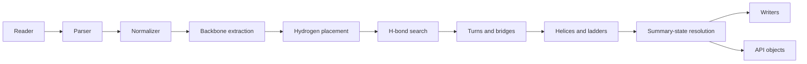
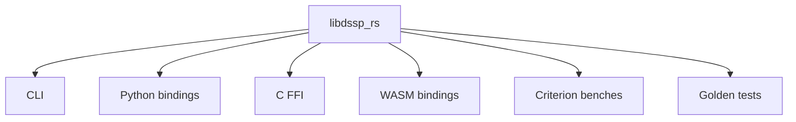

# DSSP and DSSP4

## Executive summary

DSSP began as the 1983 algorithm and standard Pascal program by Wolfgang Kabsch and Christian Sander for converting atomic protein coordinates into a reproducible, residue-level description of secondary structure, hydrogen bonding, bends, chirality, and solvent exposure. Its central design choice was to identify secondary structure primarily from backbone hydrogen-bond patterns, using a simple electrostatic energy model with a single decision threshold, rather than from hand-tuned dihedral-angle boxes alone. In the original paper, DSSP explicitly defined turns, helices, bridges, ladders, bends, chain breaks, and a priority rule for collapsing overlapping features into a one-letter summary. citeturn21search0turn22search0turn23search0

DSSP4 is not the 1983 paper. The original DSSP paper is Kabsch and Sander, *Biopolymers* 1983. The DSSP4 paper is Hekkelman, Álvarez Salmoral, Perrakis, and Joosten, *Protein Science* 2025, DOI `10.1002/pro.70208`. DSSP4 keeps the original conceptual core, but modernizes the software stack and data model: it is a C++20 rewrite, it adopts mmCIF as the primary input/output format, it adds FAIR-oriented structured annotations in mmCIF, and it extends the state alphabet to include left-handed κ-helices or Poly-Proline II helices (`P`). The project now consists of a library (`libdssp`), an executable (`mkdssp`), a Python module, a continuously updated databank, and a server/API. citeturn24search12turn26search1turn42search0turn42search4turn42search5turn32search6

For a Rust implementation, the most important architectural conclusion is this: a faithful crate should treat DSSP4 as a **reference-conforming annotation engine**, not just as a “secondary-structure classifier.” That means reproducing hydrogen-bond energies, bridge/ladder construction, overlap resolution, missing-value behavior, chain-break semantics, and output conventions closely enough to match golden outputs from `mkdssp`. A good Rust design should therefore separate parsing, normalization, geometry, hydrogen-bond search, structure assignment, and output writers into distinct modules; compute critical geometry in `f64`; expose both “reference” and “fast” execution modes; and validate continuously against outputs from the current DSSP4 reference implementation. citeturn21search0turn22search0turn40view0turn40view2turn15view0

## History and purpose

The original DSSP paper framed the problem as an attempt to approximate the intuitive notion of protein secondary structure through an objective pattern-recognition algorithm. Kabsch and Sander argued that hydrogen bonds were the best primitive for this purpose because their presence or absence can be reduced to a single continuous decision parameter, namely an energy cutoff, whereas dihedral-angle-only methods require multiple boundaries per structure class. They therefore grounded secondary-structure assignment mainly in hydrogen-bonded turns and bridges, then built helices and β-ladders on top of those elementary patterns. citeturn21search0turn22search0

The original paper also made clear that DSSP was more than a per-residue labeler. It was intended as a “dictionary” of protein structural features across the Protein Data Bank, exposing not only helices and sheets, but also hydrogen bonds, bends, chirality, disulfides, chain breaks, and solvent exposure. That broader scope remains important today because many downstream tools still depend on DSSP for residue-wise accessibility, backbone torsions, hydrogen-bond partners, and bridge/ladder topology, not only for the one-letter secondary-structure code. citeturn21search0turn36search1turn33view0

DSSP’s software lineage matters because many confusing implementation differences in the ecosystem come from interfaces around the core algorithm rather than from the algorithm itself. The DSSP site notes that the original system is now referred to as “DSSPold,” that Maarten Hekkelman rewrote DSSP in 2011, and that the legacy DSSP format was extended in 2017 to accommodate four-character chain IDs from mmCIF. The DSSP4 paper describes a further rewrite in modern C++ and an explicit FAIR turn toward mmCIF-native annotation and databank interoperability. citeturn24search15turn26search8turn42search5

The practical purpose of DSSP4 is therefore twofold. First, it preserves the reference behavior structural biologists expect from DSSP. Second, it makes that behavior easier to exchange, automate, and integrate into modern data infrastructures. PDBe’s 2025 announcement is a useful signal here: PDBe adopted DSSP4 as its standard tool for secondary-structure annotation, replacing its older DOSS-based internal pipeline, precisely because DSSP4 provides a scientifically consistent and mmCIF-interoperable annotation source across the archive. citeturn42search2turn25search17

## Algorithmic core and reference behavior

### Hydrogen-bond detection and energy model

The original DSSP hydrogen-bond definition is electrostatic. Kabsch and Sander place partial charges on the backbone carbonyl `C,O` atoms and amide `N,H` atoms and compute

\[
E = q_1 q_2 \left(\frac{1}{r_{ON}} + \frac{1}{r_{CH}} - \frac{1}{r_{OH}} - \frac{1}{r_{CN}}\right) f
\]

with `q1 = 0.42e`, `q2 = 0.20e`, and `f = 332` when distances are in Å and energy is in kcal/mol. They classify a backbone hydrogen bond when `E < -0.5 kcal/mol`. They also note that a “good” hydrogen bond is typically around `-3 kcal/mol`, and that the threshold is intentionally generous to tolerate bifurcated H-bonds and coordinate error. The paper’s geometric interpretation is also useful for tests: at ideal alignment the model gives an H-bond around `d = 2.9 Å`, and the chosen threshold permits roughly `63°` misalignment at that distance or an `N–O` distance up to about `5.2 Å` at perfect alignment. citeturn21search0turn22search0turn20search4

The contemporary DSSP documentation adds an operational detail that is easy to miss but critical for faithful reproduction: the program discards any hydrogens already present in the input and instead places backbone hydrogens computationally at `1.000 Å` from the backbone nitrogen, opposite the direction of the previous residue’s carbonyl `C=O` bond. The same documentation states that the best two H-bonds for each atom are then used in the final assignment logic. This affects reproducibility, because using deposited hydrogens or a different H-placement convention can change energies near the `-0.5` threshold. citeturn42search9turn33view0

For a Rust implementation, this means the core energy routine should be treated as **reference code**, not as a place for numerical experimentation. A crate should compute distances and inverse distances in `f64`, normalize all hydrogen placement rules before energy evaluation, and make tie-breaking deterministic when energies are equal within floating-point noise. The threshold itself should remain exactly `-0.5 kcal/mol` in reference mode. That recommendation follows directly from the original model’s threshold sensitivity and from the importance of golden-file matching against DSSP4 outputs. citeturn21search0turn22search0turn15view0

```rust
#[inline]
fn hb_energy_kcal(
    o: [f64; 3],
    n: [f64; 3],
    c_prev: [f64; 3],
    c: [f64; 3],
    h: [f64; 3],
) -> f64 {
    fn dist(a: [f64; 3], b: [f64; 3]) -> f64 {
        let dx = a[0] - b[0];
        let dy = a[1] - b[1];
        let dz = a[2] - b[2];
        (dx * dx + dy * dy + dz * dz).sqrt()
    }

    const Q1: f64 = 0.42;
    const Q2: f64 = 0.20;
    const F: f64 = 332.0;

    let r_on = dist(o, n);
    let r_ch = dist(c, h);
    let r_oh = dist(o, h);
    let r_cn = dist(c, n);

    Q1 * Q2 * (1.0 / r_on + 1.0 / r_ch - 1.0 / r_oh - 1.0 / r_cn) * F
}

#[inline]
fn is_dssp_hbond(e_kcal: f64) -> bool {
    e_kcal < -0.5
}
```

The snippet above is intentionally minimal. A production implementation should precompute hydrogen coordinates, pack backbone coordinates in structure-of-arrays form, and vectorize the distance kernel where profitable.

### Turns, helices, bridges, ladders, and bends

The original DSSP hierarchy is explicit. First, define hydrogen bonds. Then define `n`-turns for `n = 3, 4, 5` from an H-bond between `CO(i)` and `NH(i+n)`. Then build helices from **two consecutive `n`-turns**. For example, a minimal α-helix from residues `i` to `i+3` requires 4-turns starting at residues `i-1` and `i`. That definition is more specific than the common shorthand “α-helix means i→i+4 H-bonds,” and it matters when turns overlap imperfectly at helix ends. The paper also explicitly describes joining overlapping minimal helices into longer helices and tolerating irregularities such as missing internal H-bonds in kinked helices, including proline-associated imperfections. citeturn22search0turn23search0

β-structure is built from bridges. For two three-residue stretches centered on residues `i` and `j`, DSSP defines a **parallel bridge** if either `[Hbond(i-1,j) and Hbond(j,i+1)]` or `[Hbond(j-1,i) and Hbond(i,j+1)]` is present. It defines an **antiparallel bridge** if either `[Hbond(i,j) and Hbond(j,i)]` or `[Hbond(i-1,j+1) and Hbond(j-1,i+1)]` is present. Repeating bridges form ladders, and ladders connected by shared residues form sheets. The original paper further defines bulge-linked ladders as two perfect ladders or bridges of the same type connected by at most one extra residue on one strand and at most four extra residues on the other; in the summary line, all residues in those bulge-linked ladders are labeled `E`. citeturn22search0turn23search0

Bends are purely geometric. DSSP measures the angle between `Cα(i) - Cα(i-2)` and `Cα(i+2) - Cα(i)` and labels residue `i` as a bend (`S`) when that angle exceeds `70°`. Chirality is the sign of the Cα dihedral over residues `i-1, i, i+1, i+2`. Chain breaks are called when the peptide `C'–N` distance exceeds `2.5 Å`; the original paper explicitly says such break residues are labeled `!` in the detailed tables and counted in DSSP numbering. citeturn22search0

The original summary-state priority is also explicit: `H, B, E, G, I, T, S` in that order, with blanks for “other.” In other words, a residue can satisfy multiple elementary criteria, but DSSP resolves overlaps to one state. DSSP4 extends the alphabet with `P` for Poly-Proline II / κ-helix, and the current `mkdssp` documentation lists `H, B, E, G, I, P, T, S, space` as recognized states. The public docs I reviewed do not spell out the full updated precedence order involving `P`, so a faithful Rust implementation should verify that point empirically against golden outputs from `mkdssp` rather than guessing. citeturn21search0turn46view3

### What DSSP4 changes and what it preserves

DSSP4 preserves the core hydrogen-bond logic and structural vocabulary of classic DSSP, but it modernizes both the implementation and the data model. The most visible algorithmic addition is assignment of `P` for left-handed κ-helices / Poly-Proline II helices. The `mkdssp` man page says that this exists since version `4.0` and exposes a `--min-pp-stretch` parameter that controls the minimum number of consecutive residues with qualifying `φ/ψ` values required to assign a PP helix. The DSSP4 paper and PDBe announcement both emphasize that these structures are not restricted to proline-rich sequences and that they are now first-class annotated elements. citeturn46view3turn42search2turn24search12

DSSP4 also re-expresses output in structured mmCIF rather than treating legacy fixed-column DSSP text as the primary artifact. The paper describes a DSSP namespace in mmCIF, including `_dssp_struct_summary` for per-residue descriptors, `_dssp_struct_bridge_pairs` for β-bridges, `_dssp_struct_ladder` for β-sheets and ladders, and `_dssp_statistics*` categories for summary statistics. The repository test fixture confirms these categories in practice and shows that `_dssp_struct_summary` carries secondary structure, bridge/helix flags, bend/chirality, sheet/strand identifiers, accessibility, torsions, and Cα coordinates on a per-residue basis. citeturn26search2turn26search5turn40view0turn40view2turn40view3

One subtle but important preservation is that DSSP4 still behaves like a residue-wise geometric annotator rather than a prediction method. The DSSP site, the Debian man page, and Biopython’s wrapper docs all repeat the same warning: DSSP does **not** predict secondary structure from sequence; it extracts it from a fully specified 3D structure. That sounds obvious, but it has engineering consequences: missing backbone atoms, malformed chain topology, or inconsistent residue identifiers are not edge decoration. They directly determine whether an annotation can be made at all. citeturn42search9turn46view3turn33view0

## Formats, parsing, and edge cases

### PDB and mmCIF inputs

DSSP4 takes either PDB or mmCIF as input, and the `mkdssp` documentation says the input may also be gzip-compressed. DSSP4’s primary format is mmCIF, but it retains legacy PDB and legacy DSSP output modes for compatibility. The modern project README and Debian man page both say that annotated mmCIF is now the default output, with fixed-column DSSP available through an explicit output-format selection. citeturn24search10turn46view3

That shift aligns with wwPDB’s long-term move away from legacy PDB as the canonical archival representation. The wwPDB documentation describes PDBx/mmCIF as the foundation for deposition, annotation, and archiving, while the PDB format remains a constrained line-based view over much of the same information. For a Rust crate, that means mmCIF should be the primary semantic model even if PDB remains a high-value compatibility path. citeturn30search5turn30search15

Legacy PDB still carries important practical constraints. The current `mkdssp` documentation explicitly warns that PDB inputs must be formatted correctly and gives `CRYST1` as an example. The wwPDB PDB-format documentation also reminds implementers that `MODEL/ENDMDL` delimit multiple models, `TER` terminates chains, and `ATOM` and `HETATM` share the same coordinate field layout. citeturn46view3turn30search4turn30search0

### Alternate locations, missing atoms, HETATM, and residue identity

Alternate locations are first-class in both PDB and mmCIF. The wwPDB mmCIF definition of `_atom_site.label_alt_id` describes it as the placeholder that identifies alternate conformations for an atom, partial residue, or even an entire chain. If an atom is present in more than one position, a non-blank alternate-location identifier must be used for each position. citeturn30search1turn30search8

The clearest publicly accessible statement of **reference DSSP behavior** for altloc resolution is indirect but useful: Biopython’s current DSSP wrapper code explicitly says that DSSP takes the **first** suitable alternative, favoring altloc blank, `A`, or `1`, and Biopython adjusts its own disordered-residue selection to mirror that behavior. The same wrapper also documents that DSSP residue identifiers do not consider the HET field, which can cause ambiguity when `HETATM` residues share sequence numbers with polymer residues. For robust reproduction, a Rust crate should therefore implement a configurable altloc policy but default to the DSSP-compatible rule “blank, then `A`, then `1`, then first encountered.” citeturn39view0

Incompleteness should be treated carefully. The original concept of DSSP assumes a “full and valid 3D structure,” and the format docs remind us that residues with no coordinates still appear in `SEQRES` even though they are absent from coordinate records. Biopython’s parser documentation warns that permissive parsing can silently drop problematic atoms or residues, and the DSSP wrapper skips missing residues in the legacy DSSP text parse. In practice, a faithful Rust implementation should annotate only residues for which the required backbone atoms are present, emit undefined values for inapplicable geometric quantities such as terminal `φ/ψ`, and preserve enough metadata to explain why an assignment is missing. citeturn42search9turn30search0turn37search2turn39view0turn40view0

`HETATM` handling needs two separate policies. For **secondary-structure assignment**, non-polymer HET groups should not become DSSP residues. For **solvent accessibility**, the original paper explicitly says exposure was calculated in the presence of all monomers in the data set but **omitting HETATOMs** such as substrates, ligands, and heme. That historical choice is worth preserving in a reference mode if your crate exposes classic DSSP-like accessibility. citeturn21search0turn30search7

### Output models and the legacy-vs-mmCIF split

The old fixed-column DSSP text format remains operationally important because many wrappers and historical workflows still consume it. The legacy format exposes DSSP sequential residue numbers, crystallographer residue IDs, structure state, bridge partners, accessibility, H-bond partner offsets and energies, and geometric quantities such as `TCO`, `KAPPA`, `ALPHA`, `PHI`, `PSI`, and Cα coordinates. Biopython’s parser and the classic DSSP layout documentation both depend on those fixed offsets. citeturn36search1turn33view0turn39view0

DSSP4’s mmCIF output is richer and more machine-readable. In the repository test fixture, `_dssp_struct_summary` stores the per-residue summary row; `_dssp_struct_bridge_pairs` stores detailed bridge partner and energy information; and `_dssp_statistics_hbond` plus `_dssp_statistics` store archive-friendly summary counts such as total H-bonds, H-bonds per sequence offset, and protein accessible surface. The same fixture also shows standard mmCIF categories such as `_struct_conf_type` being populated with DSSP-specific criteria. citeturn40view0turn40view2turn40view3turn41view2

A Rust crate should therefore support **both** a structured mmCIF writer and a legacy DSSP writer. The mmCIF writer is the right default for new workflows. The legacy writer is still valuable for compatibility testing, because exact text matching against reference `.dssp` files is one of the easiest regression checks to automate.

```rust
#[derive(Debug, Clone, Copy, PartialEq, Eq)]
pub enum AltLocPolicy {
    DsspCompatible, // blank > A > 1 > first
    HighestOccupancy,
    Specific(char),
    FirstEncountered,
}

pub fn select_altloc<'a>(
    atoms: impl Iterator<Item = &'a AtomRecord>,
    policy: AltLocPolicy,
) -> Vec<&'a AtomRecord> {
    use std::collections::BTreeMap;

    let mut groups: BTreeMap<&str, Vec<&AtomRecord>> = BTreeMap::new();
    for atom in atoms {
        groups.entry(atom.atom_name.as_str()).or_default().push(atom);
    }

    groups
        .into_values()
        .filter_map(|alts| {
            match policy {
                AltLocPolicy::DsspCompatible => {
                    alts.iter()
                        .find(|a| matches!(a.altloc, None | Some(' ') | Some('A') | Some('1')))
                        .copied()
                        .or_else(|| alts.first().copied())
                }
                AltLocPolicy::HighestOccupancy => {
                    alts.into_iter().max_by(|a, b| a.occupancy.total_cmp(&b.occupancy))
                }
                AltLocPolicy::Specific(c) => {
                    alts.iter().find(|a| a.altloc == Some(c)).copied()
                }
                AltLocPolicy::FirstEncountered => alts.first().copied(),
            }
        })
        .collect()
}
```

## Implementations and ecosystem landscape

A first clarification is useful here: there is no historically important **Fortran** reference implementation of DSSP in the sources reviewed for this report. The original paper says the program was written in **standard Pascal**, and the current reference implementation is the modern C++ DSSP4 codebase. That distinction matters because many people loosely speak of “the DSSP source” without realizing that the historical program and the modern reference are separate code generations. citeturn21search0turn42search5

The ecosystem splits into three main classes. First, there are **reference or near-reference engines** such as DSSP4 itself and GROMACS’ native `gmx dssp`. Second, there are **wrappers** such as Biopython, which delegate the actual assignment to `mkdssp`. Third, there are **reimplementations or simplifications** such as BioJava, MDAnalysis’ `analysis.dssp`, PyDSSP, and emerging Rust crates. These categories should not be conflated in benchmarking or API design, because “secondary-structure support” can mean anything from exact reproduction of every bridge pair to a simplified C3 helix/sheet/coil classifier. citeturn24search10turn45search5turn33view0turn33view1turn33view2turn34view1turn33view4

| Project | Language | Role | License | Maintenance snapshot | Resolution / feature level | Accuracy relative to DSSP4 reference | Performance notes |
|---|---|---|---|---|---|---|---|
| **PDB-REDO DSSP / libdssp / mkdssp** | C++20 | Reference implementation | BSD-2-Clause | Active releases in 2026; Debian package 4.6.1 | Full DSSP4, mmCIF-first, legacy DSSP, `P` state, databank/server | Reference by definition | Paper snippet reports `<1 s` for ~1600 residues and just under a minute for ~160,000 residues. citeturn42search5turn32search6turn46view3 |
| **GROMACS `gmx dssp`** | C++ in GROMACS | Native reimplementation for static structures and trajectories | LGPL-2.1-or-later | Current docs in 2026.3 | DSSP-like with `H B E G I P S T`, plus trajectory-oriented loop/break symbols and optional hydrogen/neighbor-search modes | Abstract says fully compatible with DSSP v4 and much faster than original for its use case | Docs expose neighbor search, native-H vs DSSP H placement, geometry-vs-energy H-bond options. citeturn28search0turn45search3turn45search5turn47search0 |
| **Biopython `Bio.PDB.DSSP`** | Python | Wrapper around external `mkdssp` | Biopython License or BSD-3-Clause | Biopython 1.87 released March 2026 | Inherits full legacy DSSP output parsing, accessibility, H-bond partner fields | Inherits `mkdssp` results; wrapper itself is not a reimplementation | Performance dominated by subprocess call plus parsing; only first model is supported. citeturn33view0turn39view0turn32search7 |
| **BioJava `SecStrucCalc`** | Java | In-memory implementation using DSSP rules | LGPL-2.1 | BioJava 7.x actively released in 2025–2026 | DSSP-style secondary structure on `Structure` objects | Targets original DSSP rules; public API docs do not provide a DSSP4 conformance benchmark | Good JVM integration; no public throughput claims in reviewed docs. citeturn33view1turn35search0turn35search4 |
| **MDAnalysis `analysis.dssp`** | Python | Pure-Python simplified implementation | LGPL v2.1+ for the module/package | Added in MDAnalysis 2.8.0; present in 2.9.0 | Simplified; does not distinguish β-bridge types or helix subtypes | Not reference-equivalent by design | Helpful for MD workflows, but intentionally coarser than full DSSP. citeturn33view2turn35search17 |
| **PyDSSP** | Python, NumPy, PyTorch | Simplified DSSP reimplementation | MIT | Latest release 0.9.1 in Nov 2024 | C3 only (`-`, `H`, `E`); omits β-bulges | README claims average agreement >97% with original DSSP and identical H-bond pair detection logic, but not full C8 parity | Useful for ML and differentiable workflows; not a drop-in reference substitute. citeturn34view1turn34view2 |
| **PDBRust** | Rust | Parsing/analysis library with DSSP-like capability | MIT | Initial crates.io release Feb 2026 | PDB/mmCIF parsing, multi-model, altlocs, gzip, “DSSP-like” feature | Not documented as exact DSSP4 reproduction | Project page claims substantial speedups for in-memory operations, but not a DSSP4-specific benchmark. citeturn33view4turn32search17turn48search1 |

Two additional Rust crates are more relevant as **building blocks** than as full DSSP replacements. `pdbtbx` is a mature pure-Rust PDB/mmCIF parser/editor under MIT license and is a strong candidate if you want a dependable structure model without writing your own parser. `rsomics-pdb-core` is much narrower, but its API explicitly exposes alternate-location policies for `ATOM/HETATM` parsing, which makes it a useful conceptual reference for implementing a DSSP-compatible altloc resolver. citeturn33view3turn48search0turn31search17

The practical conclusion is straightforward. If your goal is **exactness**, delegate to `mkdssp` or match it. If your goal is **trajectory throughput**, study `gmx dssp`. If your goal is **Python ergonomics**, Biopython and MDAnalysis solve different layers of the problem. If your goal is a **new Rust crate**, the strongest opportunity is a crate that is both parser-aware and reference-faithful, because that combination is still under-served.

## Rust crate architecture and API design

### Recommended design defaults for the unspecified items

Because your brief leaves the Rust edition, MSRV, supported platforms, and performance targets unspecified, I would set them explicitly rather than letting them drift.

| Item | Recommended default | Rationale |
|---|---|---|
| Rust edition | **2024** | Best choice for a greenfield crate in 2026 if you want the cleanest API and ecosystem defaults. |
| MSRV | **1.85+** if edition 2024, otherwise **1.74+** for broader compatibility | Make the MSRV explicit in `Cargo.toml`, CI, and docs. |
| Tier-1 platforms | Linux x86_64 + aarch64, macOS x86_64 + arm64, Windows x86_64 | These cover normal scientific and developer use. |
| Reference-mode target | Exact state/H-bond parity with `mkdssp` on golden fixtures | Accuracy matters more than speed in this mode. |
| Fast-mode target | At least **5–10×** faster than subprocess-wrapped `mkdssp` on batch workloads, while keeping per-residue agreement >99.9% on curated corpora | This is ambitious but realistic for a Rust native implementation with shared parsing and no per-file process startup. |

Those are design recommendations, not facts about the existing DSSP codebase.

### Internal architecture

A clean Rust implementation should use a staged pipeline:



The central design choice is whether to optimize around **ownership-rich semantic objects** or around **packed numeric arrays**. For DSSP, the best compromise is a two-layer model:

1. A **semantic structure layer** for input normalization: models, chains, residues, atoms, altloc groups, insertion codes, hetero flags, and raw identifiers.
2. A **packed annotation layer** for the numeric kernel: one row per annotatable residue, with contiguous arrays for backbone atom coordinates and compact integer/string indices for identifiers.

For the kernel layer, prefer a structure-of-arrays layout such as:

```rust
pub struct BackboneTable {
    label_asym_id: Vec<SmolStr>,
    label_seq_id: Vec<i32>,
    auth_seq_id: Vec<i32>,
    comp_id: Vec<[u8; 3]>,
    flags: Vec<ResidueFlags>,

    n: Vec<[f64; 3]>,
    ca: Vec<[f64; 3]>,
    c: Vec<[f64; 3]>,
    o: Vec<[f64; 3]>,
    h: Vec<Option<[f64; 3]>>,
}
```

That layout is cache-friendly, easy to parallelize, and much better suited to SIMD than a tree of heap-allocated objects. Use the semantic layer for parsing and normalization, then compile the final backbone table once per model.

### Crates and implementation strategy

`pdbtbx` is the strongest off-the-shelf parser substrate if you want broad PDB/mmCIF support with editing and serialization in pure Rust. `pdbrust` is attractive if you want a newer, faster parser/analysis substrate and are comfortable depending on a young crate that already exposes a “DSSP-like” analysis feature and altloc handling. For linear algebra, `nalgebra` is usually a better fit than `ndarray` for DSSP’s small fixed-size vector math, although `ndarray` is useful for batch exports and ML interop. Use `rayon` for outer parallelism, and use `memmap2` or an equivalent mmap crate when reading large uncompressed archives repeatedly. citeturn33view3turn33view4turn48search0turn31search1

Zero-copy parsing is worth pursuing, but only to a point. For mmCIF, a practical strategy is:

- tokenize borrowed byte slices from the input buffer;
- borrow string fields during parse;
- normalize only the fields DSSP needs into packed owned columns.

That avoids excessive allocation in the parser while keeping the numeric kernel simple and lifetime-free. mmCIF’s flexibility makes a fully borrowed long-lived semantic graph awkward; hybrid ownership is usually the sweet spot.

### Public API and feature flags

I would expose a small public core and move everything else behind feature flags:

```rust
pub mod parse;
pub mod normalize;
pub mod geometry;
pub mod hbonds;
pub mod assign;
pub mod io;
pub mod ffi;
pub mod cli;

pub struct DsspOptions {
    pub mode: Mode,                 // Reference or Fast
    pub altloc_policy: AltLocPolicy,
    pub min_pp_stretch: usize,
    pub compute_accessibility: bool,
    pub include_other: bool,
}

pub fn assign_model(model: &Model, opts: &DsspOptions) -> Result<DsspResult, DsspError>;
pub fn assign_file(path: &Path, opts: &DsspOptions) -> Result<DsspResult, DsspError>;
pub fn annotate_mmcif(input: &[u8], opts: &DsspOptions) -> Result<Vec<u8>, DsspError>;
pub fn write_legacy_dssp(result: &DsspResult, w: impl Write) -> Result<(), DsspError>;
```

Recommended features:

- `mmcif` and `pdb` parsers separately;
- `gzip` support;
- `ffi` for a C ABI;
- `python` with `pyo3`;
- `wasm` with threads/mmap disabled or downgraded;
- `serde` for structured result export;
- `parallel` for `rayon`.

### Streaming versus in-memory modes

For a single structure, an in-memory model is simplest. For large archive processing, add a streaming mode that emits one normalized model at a time from a multi-model file or a file iterator:

```rust
pub trait ModelSource {
    fn next_model(&mut self) -> Result<Option<Model>, DsspError>;
}
```

This is especially useful if you later want to support trajectory-like pipelines over repeated snapshots in PDB/mmCIF-like forms.

### Error handling and determinism

Use a strong typed error enum with categories such as `Parse`, `Normalize`, `MissingBackbone`, `UnsupportedRecord`, `InconsistentTopology`, `Io`, and `ReferenceMismatch`. Missing per-residue atoms should generally not abort the whole run; instead, convert them into per-residue “undefined” states wherever the reference implementation does the same. Determinism matters more than clever recovery. The crate should produce the same result regardless of hash-map iteration order, OS locale, or thread scheduling.

```rust
#[derive(thiserror::Error, Debug)]
pub enum DsspError {
    #[error("I/O error: {0}")]
    Io(#[from] std::io::Error),

    #[error("parse error: {msg}")]
    Parse { msg: String },

    #[error("normalization error at {chain}:{resseq}{icode}")]
    Normalize {
        chain: String,
        resseq: i32,
        icode: char,
    },

    #[error("reference mismatch in golden test {fixture}: {msg}")]
    ReferenceMismatch {
        fixture: String,
        msg: String,
    },
}
```

### Core routines in Rust-style pseudocode

A bridge/helix-first assignment pass maps naturally to compact bitsets and post-processing:

```rust
pub fn assign_secondary_structure(bb: &BackboneTable, hb: &HbondTable) -> Vec<State> {
    let turns3 = detect_turns(bb, hb, 3);
    let turns4 = detect_turns(bb, hb, 4);
    let turns5 = detect_turns(bb, hb, 5);

    let helix_g = detect_min_helices(&turns3);
    let helix_h = detect_min_helices(&turns4);
    let helix_i = detect_min_helices(&turns5);

    let bridges = detect_bridges(hb);
    let ladders = build_ladders(&bridges);
    let bends = detect_bends(bb);
    let ppii = detect_ppii(bb);

    resolve_priority(
        bb.len(),
        &helix_h,
        &bridges,
        &ladders,
        &helix_g,
        &helix_i,
        &ppii,
        &turns3,
        &turns4,
        &turns5,
        &bends,
    )
}
```

For PPII detection, the public docs confirm the existence of a `--min-pp-stretch` parameter but do not expose the exact `φ/ψ` window in the sources reviewed here. The safe engineering choice is to implement that rule behind a trait or configuration object, fill it with the verified DSSP4 thresholds once extracted from source/golden comparisons, and keep the rest of the pipeline independent of the exact angle cutoffs. citeturn46view3

## Validation, benchmarking, packaging, and CI

### Validation strategy

The current reference project already gives you a valuable seed test set. Its repository includes `1cbs.cif.gz`, the corresponding legacy output `1cbs.dssp`, an annotated mmCIF output `1cbs-dssp.cif`, a tab-separated residue/state test file, and unit tests that compare generated output against those references. The tests also verify annotation of both mmCIF and PDB inputs and compare generated DSSP text output line-by-line, allowing for only a version-header difference. citeturn12view2turn15view0

That should become the base of a Rust validation ladder:

1. **Unit tests** for hydrogen placement, H-bond energy values, bend angles, dihedrals, and bridge formulas.
2. **Golden tests** against the reference fixtures shipped by DSSP4.
3. **Cross-validation tests** against a curated corpus of PDB/mmCIF files run through current `mkdssp`.
4. **Parser edge-case tests** for altlocs, insertion codes, duplicated sequence numbers with `HETATM`, chain breaks, missing backbone atoms, multiple models, and very large residues counts.

One especially useful edge case comes from Biopython’s parser notes: legacy DSSP output can break its own fixed-column assumptions when residue counts exceed four digits, forcing offset shifts during parse. Even if your crate writes the legacy format only for compatibility, you should test its behavior explicitly on large structures and document size-related limitations. citeturn39view0

### Accuracy metrics

For a reference-conforming Rust crate, the primary metric should be **exact per-residue state agreement** with `mkdssp`, not merely C3 agreement. I would track at least:

- exact C8+P state agreement;
- exact H-bond top-2 partner and energy agreement within tolerance;
- exact bridge-pair and ladder agreement;
- exact accessibility agreement if accessibility is implemented;
- `φ/ψ/ω/κ/α` RMSE on defined residues;
- confusion matrices for edge-case corpora.

For fast mode, it is acceptable to relax some internal ordering if and only if output equivalence remains within a documented tolerance and the deviation rate is tracked continuously.

### Benchmark plan

A good benchmark suite separates parsing cost from annotation cost. At minimum, run:

- parse-only PDB;
- parse-only mmCIF;
- normalize-to-backbone-table;
- hydrogen placement;
- H-bond search;
- full assignment;
- legacy writer;
- mmCIF annotator.

Metrics should include wall-clock runtime, peak RSS, allocations, residues per second, and candidate pair counts. Use one tiny fixture, one medium single-chain protein, one large multi-chain entry, and one very large cryo-EM assembly. Include both “clean” inputs and disorder-heavy inputs so that altloc and missing-atom policies are exercised, not only the happy path.

For performance baselines, compare against three things:

- subprocess-wrapped `mkdssp`;
- native `mkdssp` runtime where you can call it directly;
- any Rust “fast mode” or spatial-index mode you introduce.

The DSSP4 paper snippet claims that annotation of a compressed ~1600-residue model takes less than a second on a modest PC, while a ~160,000-residue microtubule model takes just under a minute. That is a useful external sanity bound for large-assembly throughput, though your own targets can and should be stricter for a modern Rust implementation. citeturn42search5

### Numerical stability and precision

Three numerical areas deserve special care.

First, H-bond energy comparisons are threshold-sensitive. Near `-0.5 kcal/mol`, tiny distance differences or alternate hydrogen placements can flip bond presence and therefore change bridges, ladders, and summary states. Compute in `f64`; if you later store values in `f32` for compactness, do so only after the classification is complete. citeturn21search0turn22search0

Second, dihedral and angle calculations become unstable when vectors are nearly collinear or nearly zero-length. Clamp dot products into `[-1, 1]`, guard norms, and define undefined output explicitly rather than letting `NaN` leak into serialized files. The repository test fixture shows that DSSP mmCIF uses missing values such as `.` where a quantity is not defined, for example at termini. citeturn40view0

Third, reproducibility requires deterministic tie-handling. If two altlocs have equal occupancy, or two candidate H-bond energies are effectively equal, your crate must still choose consistently. Otherwise cross-platform CI will produce flickering golden failures.

### Packaging, documentation, CI, and release engineering

I would organize the project as a library-first crate plus a thin CLI:



Recommended release stack:

- `cargo fmt`, `clippy`, doctests, unit tests, golden tests, and benchmarks;
- GitHub Actions matrix on Ubuntu, macOS, and Windows, across stable plus the pinned MSRV;
- optional nightly-only job for more aggressive lints or portable SIMD experiments;
- `criterion` for microbenchmarks;
- `cargo-deny` and `cargo-audit`;
- generated API docs on docs.rs;
- a versioned benchmark dashboard checked into the repository.

For the CLI, keep the surface area small and scriptable:

```text
dssp-rs assign input.cif -o out.cif
dssp-rs legacy input.cif -o out.dssp
dssp-rs validate input.cif --against mkdssp
dssp-rs bench corpus/*.cif.gz
```

For Python interoperability, `pyo3` plus `maturin` is the obvious path. For C or C++ consumers, provide a minimal stable FFI over opaque handles instead of exporting Rust data layouts directly. For WASM, support parsing and per-residue annotation, but disable mmap and thread-parallelism by default and document that very large structures are better handled natively.

The deepest documentation requirement is not “how to call the API,” but “what exact behaviors are reference-compatible.” I would dedicate one top-level documentation page to these policies: hydrogen placement, altloc selection, HETATM handling, chain-break detection, missing-value semantics, PPII detection policy, and any known differences from current `mkdssp`. That page will matter more to users than most generated API listings.

The primary sources most worth pinning in the repository documentation are the 1983 original paper for the algorithmic definitions, the 2025 DSSP4 paper for the FAIR/mmCIF redesign and κ-helix extension, the official `mkdssp` man page and PDB-REDO repository for implementation behavior and current options, the wwPDB PDB/mmCIF specifications for parser correctness, and the official docs for Biopython, BioJava, MDAnalysis, GROMACS, `pdbtbx`, and `pdbrust` for interoperability and ecosystem positioning. citeturn21search0turn24search12turn46view3turn30search0turn30search1turn30search15turn33view0turn33view1turn33view2turn45search5turn33view3turn33view4