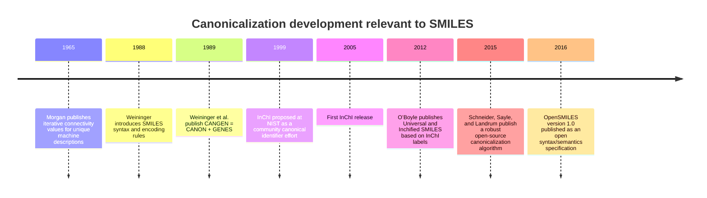
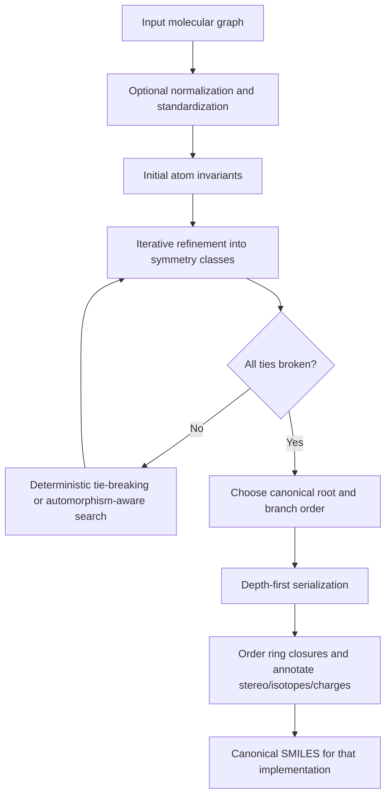

# SMILES, Canonical SMILES, and Their Parsing and Serialization

## Executive summary

SMILES is a linear notation for molecular graphs that was introduced by David Weininger in 1988 to encode atoms, bonds, branches, ring closures, and optional stereochemical and isotopic information in a compact string. Daylight later distinguished **generic SMILES** from **isomeric SMILES**, and also distinguished **unique SMILES** and **absolute SMILES** as canonical forms produced by a canonicalizer rather than by the syntax itself. OpenSMILES later formalized the language’s grammar and semantics as an open community specification, but explicitly left canonicalization algorithms out of scope. citeturn12view0turn6view1turn9view0turn33view1

The central technical fact is that **SMILES syntax and SMILES canonicalization are different problems**. Syntax is a formal language question: what strings are valid, how atoms and bonds are tokenized, how branches nest, how ring digits pair, and how stereochemical markers are interpreted. Canonicalization is a graph-theoretic question: given one molecular graph, assign deterministic atom labels and a deterministic traversal so that equivalent inputs collapse to one output string. OpenSMILES standardizes the first problem; toolkit-specific algorithms solve the second. citeturn9view0turn33view1turn12view1turn17view0

The historical canonicalization thread begins with Morgan’s 1965 iterative “connectivity value” approach, which refines local atom classes by summing neighbor values until the partition stops improving. Weininger’s 1989 CANGEN paper then replaced ambiguous neighbor sums with the **product of corresponding primes**, added explicit tie-breaking, and combined canonical ranking with a depth-first serialization procedure called **GENES**, with a published worst-case complexity of \(N^2 \log_2 N\) for CANON. Later practical systems diversified: Daylight’s production canonicalizer remained proprietary; Open Babel documented a reproducible canonical coding algorithm using symmetry classes, permutation search, layered codes, and optimizations to avoid factorial blowups; InChI introduced a separate, layered canonical identifier with normalization and tautomer handling; and O’Boyle showed in 2012 how InChI’s canonical labels can be used to generate **Universal** and **Inchified** canonical SMILES, including stereochemistry. citeturn13view0turn13view2turn14view1turn14view3turn15view0turn17view0turn17view4turn6view3turn6view4

For software engineering, the practical lessons are clear. Parse with a strict grammar and a semantic validation step; do not confuse aromatic input syntax with aromaticity perception; treat canonical SMILES as **toolkit- and version-specific**, not universal; standardize molecules before canonicalization if your application needs stable database keys; handle tautomers separately from ordinary canonical SMILES; stream large SMILES files lazily rather than loading everything into memory; and put hard limits on nesting depth, atom count, ring indices, and wall clock time when accepting untrusted input. Toolkit documentation now exposes many of these controls directly, including strict parsing modes, sanitization toggles, aromaticity controls, lazy suppliers, and canonicalization options. citeturn33view1turn27view0turn26view0turn26view1turn26view2turn29view0turn27view2turn27view3

## Definitions, history, and scope

Weininger’s original SMILES paper framed SMILES as a computer-oriented chemical notation language intended to be fast, compact, and directly usable for storage and retrieval. The syntax was deliberately simple: atomic symbols, double and triple bonds, parentheses for branches, and matching digits for ring closures, with aromatic forms handled specially. The 1989 sequel added the canonicalization problem explicitly: many valid SMILES may describe the same structure, but database applications need one deterministic form. citeturn12view0turn12view1

Daylight’s theory manual later standardized the terminology that is still widely used in software. A **generic SMILES** encodes only the labeled molecular graph. An **isomeric SMILES** additionally includes isotopic and chiral specifications. A **unique SMILES** is a canonical generic SMILES, and an **absolute SMILES** is a canonical isomeric SMILES. Daylight also makes explicit that canonicalization is an algorithmic layer on top of the notation: many legal strings may represent the same molecule, but one special string can be chosen for database purposes. citeturn6view1

OpenSMILES emerged from the Blue Obelisk community as an open specification because the original Daylight specification was proprietary and toolkit behavior had diverged. The OpenSMILES document is aimed at developers implementing parsers and writers, formally separates syntax from semantics, and gives a grammar for atoms, bonds, branches, ring closures, chirality, charges, and file-level line handling. Critically, it also states that canonical ordering algorithms are beyond the scope of the specification. citeturn8search1turn9view0turn33view1

In parallel, NIST and IUPAC developed InChI with a different objective: not a readable line notation for routine interchange, but a **layered canonical identifier** for chemical identity. The InChI Technical Manual states that InChI must distinguish different compounds while still assigning one identifier to a compound regardless of how it is drawn; it achieves this through normalization, canonicalization, and layered serialization, with layers for connectivity, charge, mobile/fixed hydrogens, isotopes, and stereochemistry. That architecture explains why InChI is closely related to, but not interchangeable with, canonical SMILES. citeturn6view3turn40view4



The timeline matters because it prevents a common category mistake: **there is no single “the canonical SMILES” standard across all software**. OpenSMILES itself warns that canonical SMILES should not be treated as a universal web-scale identifier, because different systems can use different rules or change behavior as implementations improve. That is exactly why canonical SMILES and InChI coexist: one is practical and human-readable; the other is intended to be globally stable and layered. citeturn33view1turn6view4turn32search2

## Formal grammar, syntax, and writing rules

OpenSMILES gives a compact formal grammar. An atom can be an organic-subset atom, an aromatic organic atom, a bracket atom, or `*`. A bracket atom is ordered as: optional isotope, symbol, optional chirality, optional hydrogen count, optional charge, optional atom class. Bonds include single, double, triple, quadruple, aromatic, and directional `/` and `\` bonds; ring bonds are written as an optional bond symbol followed by a digit or `%nn`; branches are parenthesized chains; and a whole SMILES is either a chain or empty before end-of-line termination. citeturn9view0

The **organic subset** is the compression rule that makes ordinary SMILES concise. Unbracketed `B, C, N, O, S, P, F, Cl, Br, I` imply default valence, zero charge, no isotope, and no chirality. Lowercase `b, c, n, o, p, s` denote aromatic organic atoms; bracketed aromatic symbols additionally include `se` and `as`. If you need non-default hydrogens, isotopes, charge, chirality, or non-organic elements, you must use brackets. citeturn11view1turn9view0

The main syntactic categories and their practical semantics are summarized below.

| Category | Main forms | Practical meaning | Notes |
|---|---|---|---|
| Atoms | `C`, `N`, `Cl`, `[Fe]`, `[13CH3]`, `[*]` | Unbracketed organic-subset atoms use implied valence and hydrogens; bracketed atoms carry full annotation | OpenSMILES grammar and atom rules. citeturn9view0turn11view1 |
| Bonds | adjacency, `-`, `=`, `#`, `$`, `:`, `/`, `\` | Adjacency implies single or aromatic as appropriate; `/` and `\` encode alkene stereo; `:` is legal but avoidable in standard writing | OpenSMILES and Daylight rules. citeturn11view2turn10view2turn33view0 |
| Branches | `CC(O)C`, nested parentheses | Parentheses encode side chains; nesting depth is unbounded in the language | Arbitrary nesting is legal. citeturn11view2 |
| Ring closures | `C1CCCCC1`, `%10` | First digit opens an “open bond”; second matching digit closes it | Bond symbol may appear on either side, but if both sides specify it they must agree. citeturn11view2 |
| Charges | `[NH4+]`, `[O-]`, `[Fe+2]` | Formal charge is part of bracket atom syntax | `++` and `--` are deprecated compatibility forms. citeturn9view0 |
| Isotopes | `[2H]`, `[13CH4]`, `[238U]` | Isotope precedes symbol inside brackets | Isotope is syntactic, not inferred. citeturn9view0 |
| Tetrahedral stereo | `@`, `@@`, `@TH1`, `@TH2` | Relative to neighbor order in the serialized graph, not an absolute spatial label | Equivalent strings can differ by traversal order. citeturn10view1turn9view0 |
| Other stereo classes | `@AL`, `@SP`, `@TBn`, `@OHn` | Allene, square planar, trigonal bipyramidal, octahedral classes are part of OpenSMILES grammar | Formal support exists in the syntax even when toolkit support varies. citeturn9view0turn10view3 |
| Disconnection | `.` | Separate components in salts, mixtures, or disconnected structures | Dot is syntactic disconnection, not itself “ionicity.” citeturn9view0 |

Aromaticity is especially important because SMILES uses **lowercase atom symbols as a promise**, not just a stylistic choice. OpenSMILES requires the parser to remember aromatic markings during parsing and only, after parsing, verify that the electron assignment, valence constraints, hydrogens, charges, and ring structure make aromaticity consistent. A bond between two aromatic atoms is assumed aromatic unless explicitly written as `-`; conversely, a true nonaromatic bond between aromatic atoms must be written explicitly, as in biphenyl `c1ccccc1-c2ccccc2`. citeturn11view0

The directional bond symbols `/` and `\` are another common source of bugs. OpenSMILES stresses that their “up” and “down” meaning is interpreted **relative to each alkene carbon**, not relative to the page or to the double bond as a whole. Earlier implementations often got this wrong, particularly in the presence of parentheses. The canonical examples are that `F/C=C/F` and `C(\F)=C/F` both describe trans difluoroethene, while `F\C=C/F` and `C(/F)=C/F` describe the cis form. citeturn10view2

For writing, OpenSMILES also gives a useful “standard form” normalization layer. It recommends omitting `-` except for a single bond between aromatic atoms, never writing `:`, not reusing ring digits, starting numbering from 1, preferring single-bond ring closures over double-bond closures when possible, favoring terminal atoms and heteroatoms as starts, preferring the aromatic form over the Kekulé form, omitting `H1` and `+1/-1` digits, and ordering bracket properties as chirality, hydrogen count, then charge. These are **serialization rules**, not canonicalization by themselves, but they reduce avoidable string diversity. citeturn33view0turn33view1

## Canonicalization theory and major algorithms

The goal of canonicalization is to map all graph-isomorphic representations of a molecule to one deterministic linearization. In practice, that means choosing a canonical atom ranking, a canonical root, a canonical order of children at each branch point, and a canonical order for ring-closure digits and stereo annotations. The hard part is that many atoms are initially indistinguishable under local descriptors, so canonicalization depends on **invariants**, **iterative partition refinement**, and **deterministic tie-breaking**. citeturn12view1turn17view0

Morgan’s 1965 algorithm is the conceptual starting point. It assigns each atom an initial “connectivity value” equal to its number of attached non-hydrogen atoms, then repeatedly replaces each atom’s value by the sum of its neighbors’ current values. The process continues while the number of distinct values increases; once refinement stops, the last values define a partial ordering. Morgan proved that the iteration terminates in at most \(X+1\) iterations for a finite graph with \(X\) nodes, and he added look-ahead and preference rules to avoid generating all equivalent numberings. The important limitation is that neighbor sums are **ambiguous**: different environments can produce identical sums. citeturn13view0turn13view2turn13view3

Weininger’s 1989 CANGEN algorithm addresses exactly that weakness. In the CANON phase, atoms receive a prioritized vector of initial invariants; equivalent ranks are then refined not by simple sums but by the **product of primes corresponding to neighbors’ ranks**, which the paper proves is unambiguous by unique prime factorization. If refinement stalls before every atom is uniquely labeled, the algorithm breaks the lowest tie and reiterates. The paper publishes an eight-step CANON procedure and gives a worst-case order of \(N^2 \log_2 N\) for the canonicalization stage. The GENES phase then chooses the lowest canonical atom as root, performs a depth-first serialization, branches toward lower labels, and uses a two-pass method for polycycles so ring-closure digits can be ordered consistently. citeturn14view1turn14view2turn14view3turn15view0turn16view0turn40view1

Daylight’s historical implementation built on this literature, but the production canonicalizer was not fully standardized in an open, implementation-level specification. The Daylight theory manual documents the meaning of unique and absolute SMILES and shows examples, but not a complete public algorithm for all corner cases. This is one reason O’Boyle could accurately write in 2012 that SMILES lacked a community standard for canonical generation even though individual vendors all had their own canonicalizers. citeturn6view1turn6view4

Open Babel is notable because it documented a practical, reproducible canonical coding algorithm. It starts from symmetry classes derived from a Morgan-like iteration over a packed graph invariant that includes graph-theoretic distance, heavy valence, aromaticity, ring membership, atomic number, heavy bond sum, and formal charge. It then assigns labels by exploring permutations inside equal-symmetry neighbor groups, generates a layered canonical code, and picks the lexicographically greatest code. The code has explicit layers: **FROM** for spanning-tree parents, **CLOSURE** for ring bonds, **ATOM-TYPES**, optional **ISOTOPES**, **BOND-TYPES**, and optional **STEREO**. Open Babel’s documentation is unusually candid about complexity: the naïve algorithm can require \(n!\) permutations inside tied groups, so it adds optimizations such as handling non-ring ligands independently. citeturn17view1turn17view2turn17view3turn17view4

OpenSMILES itself takes a different stance: it defines a canonical SMILES concept and a standard form, but explicitly says that the actual canonical ordering rules are too complex and out of scope. That is a feature, not a defect. It means OpenSMILES is the correct reference for **what a valid SMILES means**, but not for **which canonical SMILES a toolkit should emit**. citeturn33view1

The InChI relation is the cleanest route to cross-toolkit canonical consistency presently described in the literature. O’Boyle’s 2012 method uses InChI-generated canonical labels to produce either **Inchified SMILES** or **Universal SMILES**. Inchified SMILES first generates a Standard InChI, converts it back to a normalized structure, and then serializes that structure canonically. Universal SMILES instead keeps the original connection table and tautomeric state, but uses canonical labels extracted from InChI auxiliary information. This matters because Standard InChI performs normalization and is tautomer-aware through its mobile-hydrogen representation, while ordinary canonical SMILES generally are not. O’Boyle reported no canonicalization failures for Inchified SMILES on 1.1 million ChEMBL compounds and a 1 million-compound PubChem Substance subset, with Universal SMILES succeeding on about 99.8% of both sets. citeturn6view4turn30search1turn32search2turn32search9

The main algorithmic families are compared below.

| Approach | Core refinement idea | Tie-breaking and serialization | Stereo and tautomers | Strengths | Main limitation | Source |
|---|---|---|---|---|---|---|
| Morgan 1965 | Iterative neighbor-sum “connectivity values” from degree counts | Partial ordering, look-ahead, subset generation; finite in at most \(X+1\) iterations | Not a full SMILES stereo method; no tautomer normalization | Elegant and foundational | Sums are ambiguous; partial ordering may need further combinatorics | citeturn13view0turn13view2 |
| Weininger CANGEN 1989 | Initial invariants + product of corresponding primes | Explicit tie-breaking; GENES DFS; two-pass ring-digit handling; published \(N^2 \log_2 N\) CANON bound | Paper states that stricter operations can add invariants for isotope, bond directionality, and local chirality | First published full SMILES canonicalization workflow | Still implementation-specific outside the published invariant set and tie rules | citeturn14view2turn14view3turn15view0turn16view0 |
| Daylight production “unique/absolute” SMILES | Proprietary implementation built on published SMILES concepts | Public concepts, not a fully open implementation spec | Distinguishes unique vs absolute output classes | Historically influential terminology and behavior | Not an open canonical standard | citeturn6view1turn6view4 |
| Open Babel canonical code | Symmetry classes from Morgan-like graph invariants; layered canonical code | Permutation search inside tied groups; layered FROM/CLOSURE/ATOM/BOND/STEREO codes; optimizations to reduce \(n!\) growth | Optional isotope and stereo layers | Reproducible open documentation | Canonical form remains toolkit-specific | citeturn17view1turn17view2turn17view3turn17view4 |
| OpenSMILES | Not a canonicalizer; syntax and semantics specification | Canonicalization explicitly out of scope | Grammar includes stereo tokens but not canonical ordering | Essential for parser and writer conformance | Cannot answer “which canonical string?” | citeturn9view0turn33view1 |
| InChI-based Universal/Inchified SMILES | Reuse InChI canonical labels; optionally reuse InChI normalization | Tree traversal guided by InChI labels | Handles stereo; Inchified form inherits InChI normalization and tautomer behavior | Best route toward cross-toolkit agreement | Still dependent on aromatic model and toolkit serialization choices | citeturn6view4turn32search2turn32search9 |

A concise way to think about canonicalization is this:



The important analytical consequence is that canonicalization is only as stable as the **equivalence relation** you decide to respect. If you canonicalize only connectivity, stereo collapses. If you canonicalize stereochemistry, stereo is preserved. If you standardize tautomers first, tautomeric forms collapse; if you do not, they remain distinct. Canonical SMILES is therefore not one algorithm but a family of deterministic graph serializations parameterized by chemistry policy. citeturn6view1turn27view2turn27view3turn32search2

## Parsing and serialization strategies in software

A robust SMILES reader is best thought of as a **two-stage system**: a syntax recognizer plus a semantic validator. OpenSMILES itself draws this distinction explicitly. Syntax answers whether a token stream matches the grammar; semantics answers whether ring numbers come in valid pairs, whether aromatic-lowercase atoms can be assigned consistent valences and \(\pi\)-electrons, whether slash bonds are consistent, whether bracket hydrogen counts and charges are legal, and whether stereodescriptors refer to meaningful local environments. citeturn9view0turn11view0

For implementation, three parser architectures are common. A **hand-written recursive-descent parser** maps naturally onto chains and branches and is often easiest to reason about. A **lexer + parser generator** approach is attractive when the grammar is formalized and you want clearer separation of tokens and productions; this has long been discussed in the SMILES ecosystem, including in parser-generator commentary around Open Babel. Finally, **single-pass, grammar-guided state machines** are common in high-performance readers where bonding, branch stacks, and ring-closure tables are maintained incrementally. The chemistry-specific insight is that purely syntactic acceptance is insufficient; semantic checks must occur during or after parse construction. citeturn9view0turn5search19

Error handling should be explicit and layered. Open Babel’s **Smiley** parser was written to be strictly OpenSMILES-compatible and intentionally differs from the more forgiving standard parser by returning detailed syntax and semantic diagnostics. CDK exposes a strict mode and throws `InvalidSmilesException` when parsing fails. RDKit exposes parser parameters such as `sanitize`, `removeHs`, `allowCXSMILES`, and `strictCXSMILES`, and in C++ it throws `MolSanitizeException` on sanitization failures such as impossible valence states. OEChem similarly distinguishes the high-level `OESmilesToMol` function, which also perceives rings, aromaticity, and chirality, from lower-level parsing functions. citeturn26view0turn26view1turn26view2turn26view3turn26view4turn26view5

Serialization has its own engineering choices. Writers must decide whether to output aromatic or Kekulé forms, whether to suppress or force hydrogens, whether to include isotopes and stereo, how to choose ring digits, and whether to preserve atom maps or other annotations. OpenSMILES standard-form recommendations help make writers stable even when they are not canonical: prefer aromatic over Kekulé when chemically justified, avoid `:` bonds, use simple ring digits where possible, and strip stereo markers that do not describe real stereochemistry. citeturn33view0turn33view1

The major pitfalls are not merely syntactic.

| Pitfall | Why it happens | Consequence | Mitigation |
|---|---|---|---|
| Aromaticity model mismatch | Aromatic lowercase syntax is input, but aromaticity perception is toolkit-policy-dependent | Same graph can serialize differently, especially in fused systems or unusual heterocycles | Standardize aromaticity before canonicalization; do not compare canonical SMILES across toolkits without controlling aromaticity model. citeturn11view0turn19search15turn27view2turn27view3 |
| Invalid aromatic input accepted permissively | Some parsers are forgiving or preserve aromatic markings | Silent reinterpretation or undefined behavior | Use strict parsers on untrusted input; avoid Open Babel “preserve aromaticity” except within same-version pipelines. citeturn26view0turn27view0 |
| Misread alkene stereo | `/` and `\` are relative to local atom order, not page geometry | Cis/trans inversion bugs | Validate slash semantics after parse; test parenthesized cases explicitly. citeturn10view2 |
| Spurious tetrahedral `@` | Traversal order can make non-chiral centers look superficially annotated | False stereochemistry in written output | Remove stereo on non-stereogenic centers during cleanup or canonical writing. citeturn33view0turn27view0 |
| Ring-digit misuse | Digits are paired open/close markers, not arbitrary labels | Invalid strings or weird nonstandard encodings | Validate exact pairing; in writers, avoid reuse and prefer small digits. citeturn11view2turn33view1 |
| Atom maps polluting canonicalization | Maps are annotations, but some canonicalizers can consider them | Unwanted instability in mapped reaction pipelines | Use options such as RDKit’s `ignoreAtomMapNumbers` when maps are metadata only. citeturn28view2 |
| Expecting tautomer invariance from ordinary canonical SMILES | Canonicalization preserves the given graph unless an external normalization step is applied | Distinct tautomers remain distinct strings | Separate standardization/tautomer handling from canonical writing; use InChI-style normalization if tautomer collapse is desired. citeturn6view4turn32search2turn32search9 |

An engineering inference follows directly from the grammar: because branches can nest to arbitrary depth, a naïve recursive-descendent parser should impose an application-level recursion or stack limit even though the language itself does not. That is not a chemistry rule; it is a robustness requirement for production parsers exposed to untrusted strings. The same is true for giant ring indices, pathological disconnected-component counts, and adversarial symmetry cases. citeturn11view2turn17view4

## Worked examples

The examples below make the abstract discussion concrete. The **parse sketches** follow OpenSMILES/Daylight syntax; the **symmetry classes** and **illustrative canonical outputs** are shown using RDKit-style canonical ranks and `MolToSmiles`, purely to make canonicalization steps visible. OpenSMILES explicitly warns that canonical SMILES are not universal across systems, so the canonical outputs should be read as **implementation-specific illustrations**, not cross-toolkit truth. citeturn28view1turn28view0turn33view1

| Molecule | Input SMILES | Parse sketch | Symmetry classes | Illustrative canonical output | What it shows |
|---|---|---|---|---|---|
| Ethanol | `OCC` | `O`–`C`–`C` | `[1,2,0]` | `CCO` | Same graph, different roots; Daylight and OpenSMILES both use ethanol as a simple canonical example. citeturn6view1turn33view1 |
| Phenol | `c1ccccc1O` | aromatic six-membered ring opened with `1`, closed at final `1`, terminal `O` attached | `[4,2,1,2,4,6,0]` | `Oc1ccccc1` | Aromatic lowercase atoms, ring digit pairing, terminal heteroatom preferred in common canonical outputs. citeturn11view0turn33view1 |
| trans-Difluoroethene | `F/C=C/F` | `F` attached to alkene carbon with `/`, then `=`, then second `/F` | `[0,2,2,0]` | `F/C=C/F` | Slash semantics encode alkene geometry relative to local atom ordering. citeturn10view2 |
| Chiral halocyclohexane | `FC1C[C@](Br)(Cl)CCC1` | `F` substituent, ring `1...1`, tetrahedral center with branches `(Br)(Cl)` | `[0,7,6,8,2,1,5,3,4]` | `FC1CCC[C@](Cl)(Br)C1` | Tetrahedral stereo is preserved while branch order can change under canonicalization. citeturn10view1turn28view0 |
| Isotopically labeled methylammonium | `[13CH3][NH3+]` | bracket atom with isotope and H-count followed by positively charged bracket atom | `[0,1]` | `[13CH3][NH3+]` | Bracket atom property order and isotope/charge handling. citeturn9view0turn33view0 |
| Sodium acetate | `[Na+].[O-]C(=O)C` | disconnected cation `.` anion, anion parsed as `[O-]-C(=O)-C` | `[0,3,4,2,1]` | `CC(=O)[O-].[Na+]` | Dots separate components; canonicalization still orders components deterministically within a toolkit. citeturn9view0turn17view4 |
| Decalin | `C1CC2CCCCC2CC1` | bicyclic aliphatic fused ring with two closure digits | `[0,4,8,4,0,0,4,8,4,0]` | `C1CCC2CCCCC2C1` | Polycyclic ring-closure ordering is exactly why GENES uses a two-pass method. citeturn16view0 |
| Naphthalene | `c1ccc2ccccc2c1` | fused aromatic system using two ring closures | `[0,0,4,8,4,0,0,4,8,4]` | `c1ccc2ccccc2c1` | Aromatic fused systems often expose toolkit aromaticity-model differences. citeturn11view0turn19search15 |
| 2-Pyridone | `O=c1cccc[nH]1` | carbonyl `O=`, aromatic-like heterocycle with `[nH]` closure | `[0,6,4,2,1,3,5]` | `O=c1cccc[nH]1` | Explicit `[nH]` is required for aromatic N bearing hydrogen. citeturn11view0turn9view0 |
| 2-Hydroxypyridine | `Oc1ccccn1` | terminal `O` attached to heteroaromatic ring | `[0,6,4,2,1,3,5]` | `Oc1ccccn1` | Distinct tautomer with different graph and therefore different ordinary canonical SMILES. citeturn32search2turn32search9 |

Two examples are worth unpacking in more detail.

For **phenol**, the parser sees an aromatic carbon `c`, an open ring digit `1`, five more aromatic carbons, a matching close digit `1`, and then an `O` substituent. Semantically, the aromatic designation must survive verification as a six-\(\pi\)-electron ring; syntactically, the ring digit pair is well formed. Canonicalization then treats the graph as a labeled ring with one heteroatom substituent. Because canonicalization prefers one deterministic root and one deterministic traversal, toolkit output often becomes `Oc1ccccc1` rather than the equally valid input `c1ccccc1O`. Daylight and OpenSMILES both use phenol to illustrate this exact kind of collapse from many valid forms to one canonical form. citeturn6view1turn11view0turn33view1

For the **2-pyridone / 2-hydroxypyridine** tautomer pair, ordinary SMILES canonicalization preserves the input graph, so the keto and enol tautomers remain distinct canonical SMILES. InChI is different: Standard InChI is defined in terms of tautomer-invariant connectivity with mobile/fixed hydrogen layers, so supported tautomer families can collapse to one identifier even when their SMILES stay different. This is the clearest operational difference between “canonicalization of a graph” and “normalization of chemical identity.” citeturn32search2turn32search9turn6view4

## Implementations, performance, and security

The major toolkits all support SMILES round-tripping, but they expose different assumptions and controls.

| Toolkit | Main languages / bindings | Parse API | Write / canonicalize API | Canonicalization notes | Source |
|---|---|---|---|---|---|
| RDKit | C++ and Python are primary; Java is also referenced in the C++ getting-started guide as a managed-memory language | `MolFromSmiles`, `SmilesParserParams` | `MolToSmiles`, `CanonicalRankAtoms`, `SmilesWriteParams` | Canonical output supports options for stereo, Kekulé, forced root, random traversal, and ignoring atom maps | citeturn31search10turn31search5turn26view1turn28view0turn28view1turn28view2turn28view4 |
| Open Babel | C++ core with Python, Java, Perl, Ruby, C#, and more via SWIG | `OBConversion` / standard parser; strict `Smiley` parser | `can` format, `-c`, `-U`, `-I`, `Canonical SMILES format` | Exposes canonical, Universal, and Inchified SMILES; strict vs forgiving parser split is explicit | citeturn31search11turn31search15turn27view0turn27view1turn26view0 |
| CDK | Java | `SmilesParser.parseSmiles`, `setStrict` | `SmilesGenerator(SmiFlavor...)` | Distinguishes Generic, Unique, Isomeric, Absolute; canonical core `Canon` class is Weininger-style and non-stereo by default | citeturn31search21turn26view3turn27view5turn36view0 |
| OEChem | Python, C++, Java | `OESmilesToMol`, lower-level `OEParseSmiles` | `OECreateCanSmiString`, `OECreateIsoSmiString`, `OEMolToSmiles` | Daylight terminology mapped explicitly: canonical = unique, canonical isomeric = absolute; output depends on aromaticity and stereo state unless standardized first | citeturn31search4turn31search9turn26view4turn26view5turn27view2turn27view3turn37search0 |
| Indigo | C / Java / C# / Python; newer releases also mention R and WebAssembly | `loadMolecule`, `iterateSmilesFile` | `smiles()`, `canonicalSmiles()`, `standardize()` | Canonical SMILES is documented as absolute/canonical; standardization and aromaticity options matter in practice | citeturn34search0turn31search13turn35view1turn35view2turn35view3turn27view4 |

A few short API examples capture the normal workflow from **SMILES → molecule → SMILES**.

```python
# Python: RDKit
from rdkit import Chem

mol = Chem.MolFromSmiles("c1ccccc1O")
ranks = list(Chem.CanonicalRankAtoms(mol, breakTies=False))
can = Chem.MolToSmiles(
    mol,
    isomericSmiles=True,
    canonical=True,
    kekuleSmiles=False,
    ignoreAtomMapNumbers=True,
)
print(ranks, can)
```

RDKit documents `MolToSmiles` options for isomeric output, Kekulé output, canonicalization, forced starting atom, random output, and ignoring atom-map numbers; it also documents `CanonicalRankAtoms` as the atom ranking used by canonicalization routines. citeturn28view0turn28view1turn28view2turn28view4

```java
// Java: CDK
SmilesParser sp = new SmilesParser(DefaultChemObjectBuilder.getInstance());
sp.setStrict(true);
IAtomContainer mol = sp.parseSmiles("c1ccccc1O");

SmilesGenerator abs = new SmilesGenerator(SmiFlavor.Absolute);
String out = abs.create(mol);
System.out.println(out);
```

CDK’s parser throws `InvalidSmilesException` on invalid input, supports strict mode, and its `SmilesGenerator` exposes the Daylight-style Generic / Unique / Isomeric / Absolute flavor distinction. citeturn26view3turn27view5

```cpp
// C++: RDKit
#include <GraphMol/SmilesParse/SmilesParse.h>
#include <GraphMol/SmilesParse/SmilesWrite.h>

std::unique_ptr<RDKit::ROMol> mol(RDKit::SmilesToMol("c1ccccc1O"));
std::string out = RDKit::MolToSmiles(*mol);
```

RDKit’s C++ documentation also notes that sanitization failures after SMILES parsing throw `MolSanitizeException`, which is exactly the behavior you want when invalid chemistry should fail fast. citeturn26view2turn28view0

For the other toolkits, the equivalent patterns are straightforward:

```python
# Python: OEChem
from openeye import oechem
mol = oechem.OEGraphMol()
oechem.OESmilesToMol(mol, "c1ccccc1O")
print(oechem.OEMolToSmiles(mol))
```

```python
# Python: Indigo
from indigo import Indigo
indigo = Indigo()
mol = indigo.loadMolecule("c1ccccc1O")
print(mol.canonicalSmiles())
```

```cpp
// C++: Open Babel
OBMol mol;
OBConversion conv;
conv.SetInFormat("smi");
conv.ReadString(&mol, "c1ccccc1O");
conv.SetOutFormat("can");
std::string out = conv.WriteString(&mol, true);
```

Those APIs are documented in their respective toolkit references. citeturn26view4turn35view1turn35view2turn27view1turn27view2turn27view3

On performance, three points are firm. First, canonicalization is always slower than ordinary writing, because non-canonical serialization can skip canonical numbering; Open Babel’s docs say this directly for `smi` versus `can`. Second, practical performance depends heavily on symmetry and aromaticity policy, not just atom count. Third, modern libraries also expose **streaming** APIs so that parse throughput is not dominated by memory pressure: RDKit’s `SmilesMolSupplier` is lazy by default and can avoid constructing all molecules until iteration requests them. citeturn27view1turn29view0

For concrete numbers, RDKit’s 2025 benchmark on 10,000 ChEMBL-derived SMILES measured about **1.2 s** to parse 10,000 molecules and about **658 ms** to generate canonical SMILES for those already-parsed molecules, which is roughly 8.3k molecules/s for parse and 15.2k molecules/s for canonical writing on that setup. A separate 2020 NextMove slide deck reported illustrative cross-toolkit canonicalization throughputs of about **6.8k mol/s** for RDKit 2019, **7.3k mol/s** for InChI via Open Babel, **10.3k mol/s** for Open Babel, and **50k mol/s** for OEChem; because the slide is not a controlled journal benchmark with a fully specified methodology in the excerpt, those figures are best treated as rough directional context, not as definitive comparative truths. citeturn24view0turn25view0turn40view3

Security follows directly from the grammar and the algorithms. The OpenSMILES language allows arbitrary branch nesting; ring closures require stateful matching; aromaticity requires post-parse semantic checks; and some canonicalizers explore permutations inside tied symmetry classes, which Open Babel documents as potentially factorial without pruning. In production systems, untrusted SMILES should therefore be handled with strict parsing, bounded depth, bounded size, timeouts around canonicalization, and clear separation between parsing and chemistry sanitization. Avoid “preserve aromaticity from input” shortcuts on foreign data, because Open Babel explicitly warns that this is only safe for same-version Open Babel output and otherwise yields undefined behavior. citeturn11view2turn26view0turn17view4turn27view0

## Validation and recommended best practices

Testing a SMILES implementation is never just about grammar acceptance. A serious validation plan should combine **spec conformance**, **round-trip invariance**, **randomized atom-order stress tests**, **cross-toolkit differential tests**, and **large-corpus regression tests**. Open Babel’s paper states that its canonicalization algorithm was tested by verifying that the same canonical SMILES is obtained after changing atom order while preserving connectivity, which is exactly the right invariance property for canonicalization. O’Boyle’s Universal/Inchified SMILES work adds the large-corpus dimension by testing over millions of structures from ChEMBL and PubChem subsets. citeturn37search14turn6view4turn30search1

A practical validation corpus should include at least five classes of examples. First, the small formal examples from Daylight and OpenSMILES, because they define intended syntax and normalization behavior. Second, high-symmetry graphs such as cubane-like or fused-ring systems, because tie-breaking failures often hide there; Weininger’s 1989 paper deliberately uses cubane to illustrate this. Third, aromatic and heteroaromatic edge cases, because aromaticity models diverge most there. Fourth, stereo edge cases, especially slash bonds with branches and ring-bond stereo. Fifth, tautomeric pairs when your pipeline also standardizes or emits InChI. citeturn6view1turn9view0turn16view0turn10view2turn32search2

The best practices below are the ones I would actually implement in production software.

| Practice | Why it is best practice | Source |
|---|---|---|
| Separate parsing from chemical sanitization | Syntax can succeed while chemistry fails; error reporting is far better when these phases are distinct | citeturn9view0turn26view2turn26view3 |
| Prefer strict parsing for untrusted input | Forgiving readers are useful for legacy data, but dangerous for validation pipelines | citeturn26view0turn26view3 |
| Standardize aromaticity before canonicalization | Canonical output can depend on aromaticity state and aromaticity model | citeturn27view2turn27view3turn19search15 |
| Decide explicitly whether tautomer collapse is in scope | Ordinary canonical SMILES preserve graphs; InChI-style normalization may collapse supported tautomer families | citeturn32search2turn32search9turn6view4 |
| Treat canonical SMILES as toolkit- and version-specific | OpenSMILES explicitly warns against assuming global universality | citeturn33view1 |
| Use lazy/streaming readers for large files | Avoids unnecessary memory pressure and supports scalable batch ingestion | citeturn29view0 |
| Ignore atom maps during canonicalization when maps are metadata | Otherwise mapping annotations can destabilize database keys | citeturn28view2 |
| Re-test canonicalization after every toolkit upgrade | Bug fixes or chemistry-model changes can legitimately alter canonical output | citeturn33view1turn27view0 |

The most important architectural recommendation is to choose one of two modes and be consistent. If your goal is **faithful structural interchange**, preserve as much of the original graph as possible and use canonical SMILES only within one toolkit/version family. If your goal is **stable identity keys**, then standardize first, canonicalize second, and consider adding Standard InChI or InChIKey alongside canonical SMILES. That mixed strategy aligns with how the source literature itself separates graph serialization from identity normalization. citeturn6view3turn6view4turn32search2

The load-bearing primary references remain the original Weininger papers for SMILES syntax and CANGEN, the Daylight theory manual for the classic terminology of unique and absolute SMILES, the OpenSMILES specification for formal grammar and serialization norms, the Open Babel canonical coding documentation for one open, implementation-level canonicalizer, and the InChI Technical Manual plus O’Boyle’s 2012 paper for the strongest available account of how a cross-toolkit canonical labeling source can be used to derive canonical SMILES. citeturn12view0turn12view1turn6view1turn9view0turn17view0turn6view3turn6view4