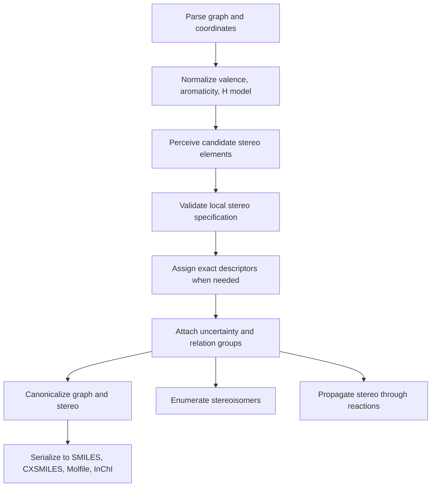
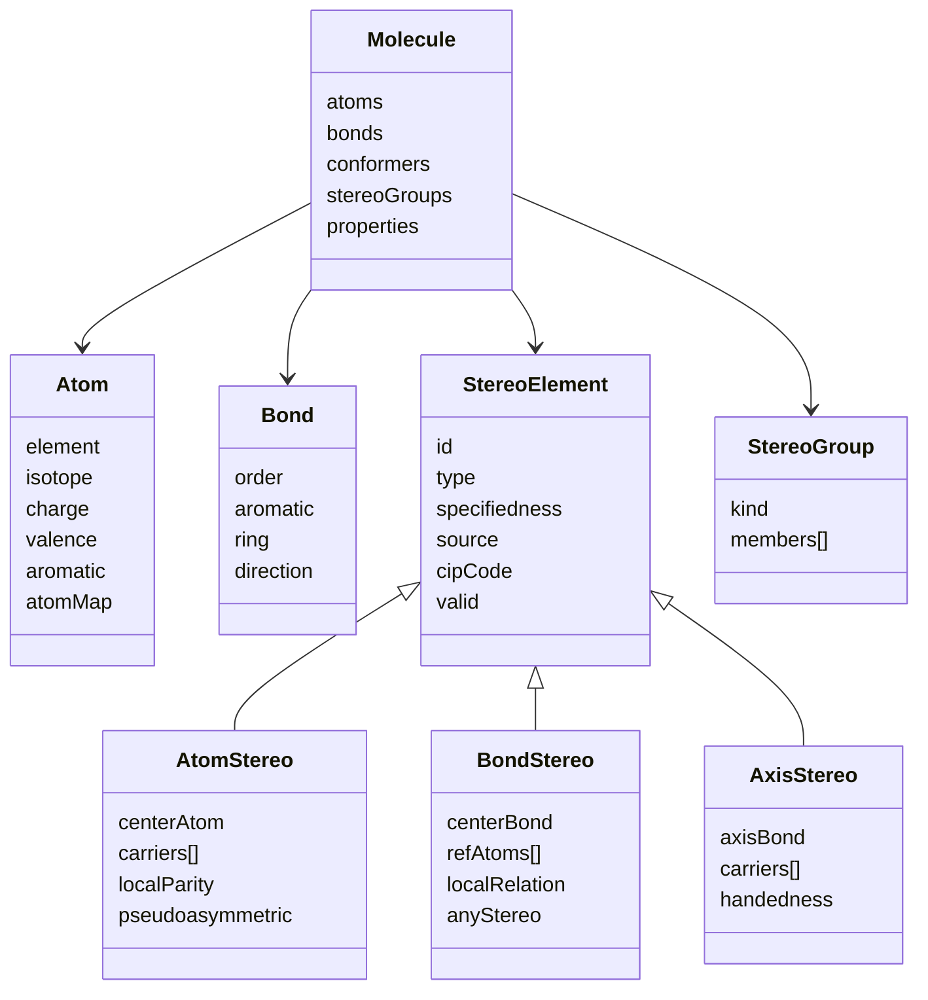

# Handling Stereochemistry in Cheminformatics for the molecular Project

## Executive summary

A robust stereochemistry implementation should treat stereo as a **first-class layer on top of the molecular graph**, not as an incidental property of coordinates or string syntax. In practice, that means separating at least five concerns: candidate perception, exact descriptor assignment, uncertainty handling, serialization, and canonicalization. The primary standards all make this separation explicit in different ways: IUPAC distinguishes configuration from conformation; Daylight SMILES encodes **local** chirality and directional bonds; CTfiles combine atom/bond flags with 2D/3D coordinates and enhanced-stereo collections; InChI isolates stereochemistry in dedicated layers; and RDKit’s own APIs split stereo perception, CIP assignment, enhanced stereo groups, and coordinate-based assignment into different modules. citeturn17view0turn11view2turn7view0turn7view2turn31view3turn30view0turn32view0turn22view0

For your `molecular` project, the most defensible architecture is a **two-tier algorithmic pipeline**. A fast graph-based pass should identify potentially stereogenic atoms, bonds, and atropisomeric axes, while a slower exact pass should assign formal descriptors only where needed. For exact atom/bond labeling, the best current implementation target is the machine-oriented CIP formulation analyzed by Hanson, Mayfield, Vainio, Yerin, and Redkin and embodied in RDKit’s `CIPLabeler`, which RDKit itself documents as more accurate than its older approximate Labute-style assignment. CIP labels should be treated as **derived cache**, not canonical stored state, because true CIP ranking is local to a stereogenic unit and does not define a globally meaningful atom order. citeturn15search0turn23search1turn22view2turn23search8

The single biggest design mistake to avoid is collapsing all “non-specified stereo” into one bucket. Standards and toolkits distinguish at least: **specified**, **unknown/explicitly undefined**, **unspecified/missing**, **relative-only**, **racemic**, and **achiral after validation**. InChI explicitly distinguishes unknown from missing stereo and supports relative or racemic handling only in non-standard modes; V3000 CTfiles model absolute, relative, and racemic stereochemistry with separate collections; SMILES allows partial local chirality and partial alkene specification; RDKit preserves enhanced stereo groups through many operations. Your internal data model should therefore preserve these distinctions directly instead of re-deriving them heuristically after parsing. citeturn30view0turn39view1turn39view3turn31view3turn11view2turn25view4

On interoperability, a pragmatic minimum viable target is: **SMILES/CXSMILES**, **Molfile/SDF V2000 and V3000**, and **InChI**. Base SMILES is essential for compact graph I/O, CXSMILES is the most practical extension for enhanced stereo and wedging metadata, Molfile/SDF is indispensable for 2D/3D and registration workflows, and InChI is the strongest normalized identifier for cross-system comparison. You should expect some lossiness between formats unless you explicitly model enhanced stereo groups, coordinate-derived wedge state, and relative/racemic semantics. Round-trip tests must therefore be semantic, not bytewise. citeturn11view2turn25view1turn7view0turn7view2turn31view3turn30view0turn39view3

Toolkits reinforce the same implementation lesson. RDKit is currently the richest open toolkit for modern stereo work, but it still exposes meaningful edge cases: the old and new stereo-perception pipelines differ; exact CIP labeling is slower and separate; non-tetrahedral stereo support is still partial; stereogroup canonicalization has had inconsistencies; and recent issues have affected enumeration and sanitization in stereo-heavy edge cases. Open Babel’s model is strongly local-and-relative; OEChem explicitly stores stereo independently of coordinates and offers dedicated conversion routines between internal stereo and MDL bond stereo; CDK uses explicit stereo-element objects and mapping methods that are especially instructive for graph transforms and reactions. Those differences point toward one clear recommendation: store **explicit stereo elements plus relation groups** in your own graph, and make every serializer/transformer a view over that internal model. citeturn22view2turn23search8turn34view4turn35view2turn35view0turn36view4turn33view1turn33view0turn33view3

## Foundations

Stereochemical software benefits from using IUPAC terminology precisely, because several distinctions that are easy to blur in code are treated as separate concepts in the standards. **Chirality** is the geometric property of being non-superposable on a mirror image. A **stereogenic center** is an atom such that interchange of two groups produces a stereoisomer. More generally, IUPAC recognizes **chirality elements** including a chirality centre, axis, or plane. That broader notion matters for computation because atom-centered chirality is not enough: allenes and biphenyl-like atropisomers can be chiral without a tetrahedral carbon center, and cyclophanes or trans-cyclooctene can exhibit planar chirality. citeturn14search24turn13search0turn14search9turn13search5turn14search21turn14search25turn14search1

IUPAC also separates **configuration** from **conformation**. Configuration is the stereochemical arrangement that distinguishes stereoisomers not interconverted by mere conformational change, whereas conformation concerns arrangements interconverted by rotation about formally single bonds. This distinction is foundational for implementation. A tetrahedral center with R/S assignment is configurational. A chair flip of cyclohexane is conformational. **Atropisomers** are the instructive boundary case: IUPAC defines them as a subclass of conformers that are isolable as separate species because restricted rotation raises the barrier enough for distinct stereoisomers to exist experimentally. In other words, atropisomerism is conformational in origin but configurational in practice once the barrier is high enough. A data model that only has `AtomChirality` and `BondStereo` but no notion of an axis or restricted-rotation unit will eventually fail on medicinal-chemistry macrocycles and biaryls. citeturn40search30turn40search28turn40search1turn14search7

The familiar descriptors follow from these distinctions but should not be confused with them. **R/S** label tetrahedral configurations after CIP ranking; **E/Z** label double-bond configurations after CIP ranking on each end; **P/M** are preferred IUPAC descriptors for stereogenic axes in many cyclic/axial cases, though `R_a/S_a` are also encountered historically. The Blue Book explicitly recommends `M` and `P` for stereogenic axes in relevant cyclic contexts. SMILES, by contrast, does **not** directly encode “R” or “S”; it encodes local chirality with `@` and `@@`, whose meaning depends on atom order in the string. That difference is not cosmetic. It means parsing and writing must preserve the underlying graph stereo independently of the textual descriptor used to serialize it. citeturn17view0turn11view2

Several chemically important special cases have direct software consequences. A **meso compound** is the achiral member of a diastereomeric set that also contains chiral members. Enumeration logic must therefore collapse stereochemical combinations that are symmetry-equivalent and achiral; naïve `2^n` enumeration is wrong whenever meso reduction applies. **Relative configuration** is reflection-invariant and describes stereogenic units with respect to each other rather than absolutely; IUPAC explicitly contrasts it with absolute configuration. Enhanced-stereo semantics in files and toolkits exist largely to preserve these relation-only cases. citeturn13search15turn40search3turn40search11turn31view3

A well-designed implementation must also preserve **stereochemical uncertainty** explicitly. The InChI FAQ is unusually clear here: unknown stereo can be represented explicitly and is distinct from simply missing stereo, while standard InChI also assumes absolute stereo when stereo is present, not relative or racemic. In V3000 CTfiles, relative and racemic stereochemistry are represented as dedicated collections (`MDLV30/STERELn` and `MDLV30/STERACn`), separate from absolute (`MDLV30/STEABS`). This implies that your internal state should include at least a `specifiedness` field and a `group semantics` field, instead of overloading a single “stereo present” boolean. citeturn30view0turn39view3turn31view3

## Algorithms

A stereo-capable cheminformatics core works best when the processing pipeline is explicit:



This decomposition matches both the standards and the better toolkit APIs: RDKit has separate entry points for candidate perception (`FindPotentialStereo`), coordinate assignment (`AssignStereochemistryFrom3D`, `AssignChiralTypesFromBondDirs`), legacy labeling (`AssignStereochemistry`), exact CIP labeling (`rdCIPLabeler.AssignCIPLabels`), enhanced stereo groups, and enumeration. OEChem likewise separates internal storage from coordinate perception and MDL bond-stereo conversion. citeturn22view0turn32view0turn23search0turn33view0

### Exact CIP implementation

The formal sequence rules in the Blue Book are hierarchical. Rule 1 compares atomic number and, for duplicate nodes introduced by ring closures or multiple bonds, favors duplicate atoms corresponding to atoms closer to the root of the exploration pathway. Rule 2 compares isotopic mass when Rule 1 cannot decide. Rule 3 handles sequence-based cis/trans precedence. Rule 4 introduces descriptor-based comparisons including pseudoasymmetry, and Rule 5 ultimately privileges `R` over `S` when necessary. Hanson and coauthors showed that machine implementation exposes ambiguities in Blue Book wording, especially in Rules 1b and 2, and proposed revised machine-oriented formulations; RDKit’s modern CIP labeler is explicitly based on that work. citeturn19view0turn18view2turn18view3turn18view4turn15search0turn23search1turn38view0

The core implementation idea is to compare ligands using a **hierarchical digraph** rooted at the stereogenic unit. The digraph must represent rings and multiple bonds using duplicate nodes, because CIP compares substituent environments as if multiple-bonded atoms were duplicated and ring paths were explored without infinite looping. The Blue Book’s stereochemistry chapter is explicit that duplicate nodes are required for saturated rings and that mancude rings are treated as Kekulé structures; RDKit’s exact CIP labeler exposes `calcFracAtomNums()` specifically to handle resonant-ring cases with fractional atomic-number treatment so that different resonance placements do not perturb priority. citeturn19view2turn17view0turn38view2

A rigorous implementation should therefore follow a step sequence like this:

```text
function assign_cip_descriptor(stereo_unit):
    identify root and ligands
    build one exploration digraph per ligand
    introduce duplicate nodes for:
        - ring closures
        - multiple bonds
        - relevant resonance/mancude treatments
    compare ligands sphere-by-sphere:
        Rule 1a: higher atomic number wins
        Rule 1b: nearer duplicate node wins
        Rule 2: higher isotope mass wins
        Rule 3: seqcis/Z > seqtrans/E > nonstereogenic when applicable
        Rule 4: compare descriptor patterns, chiral > pseudoasymmetric > nonstereogenic,
                then like-pairs vs unlike-pairs, then r > s
        Rule 5: R > S if still unresolved
    if the ranked order defines a tetrahedral unit:
        orient lowest-priority ligand away
        evaluate handedness of 1->2->3
        return R or S (or r/s for pseudoasymmetric cases)
    if the ranked order defines a double bond:
        rank each substituent pair independently
        test whether top-priority substituents lie on same or opposite side
        return Z or E
    if the ranked order defines an axis/plane:
        evaluate according to axial/planar convention
        return M/P or related descriptor
```

The parts that most often fail in first implementations are the ones that look “annoying” rather than “deep”: isotopes, implicit hydrogens, aromatic resonance, and pseudoasymmetry. The Blue Book explicitly says isotopes are ignored until Rule 2 is needed; e.g. `^2H` outranks H only after Rule 1 cannot distinguish otherwise identical ligands. Daylight SMILES is also a reminder that implicit hydrogens are semantically different from explicit `[H]`, and when tetrahedral chirality is expressed in SMILES the order of neighbors is the literal string order, with implicit hydrogen participating in that local order. In RDKit’s candidate detector, degree-3 atoms with one implicit H are considered potential tetrahedral centers. citeturn18view2turn11view2turn22view0

From a complexity standpoint, exact CIP assignment is the hardest part of stereo handling. Candidate detection is roughly graph-linear per pass, but exact digraph construction and comparison can become very expensive on highly symmetric graphs because multiple exploratory branches remain tied for a long time. RDKit’s exact labeler explicitly provides a `maxRecursiveIterations` parameter and documents that highly symmetrical molecules such as dodecahedrane can otherwise cause pseudo-infinite processing; the same header notes that most structures require well under 10,000 iterations, while pathological cases may need explicit protection. That is a strong signal that your production implementation should combine memoization, cycle guards, structural hashing of digraph subproblems, and a configurable recursion/iteration cap. citeturn38view0turn38view2

### Candidate perception, bond stereo, and graph propagation

Not every stereogenic unit needs full CIP analysis before you know whether it is a candidate. RDKit’s `FindPotentialStereo()` documents a fast candidate-identification workflow: find potential atoms and bonds, temporarily mark them uniquely, run canonical ranking without fully breaking ties, remove cases whose relevant neighbors remain equivalently ranked, iterate until stable, then return the survivors. RDKit states that this newer approach is more accurate, especially for para-stereochemistry, and faster than the older `AssignStereochemistry()`-based candidate identification. That is a sensible architecture for your project too: a fast **candidate sieve** first, exact labels second. citeturn22view0turn22view2turn22view4

For double bonds, the practical rule set is narrower but still subtle. RDKit says a double bond is potentially stereogenic if both end atoms have at least two heavy-atom neighbors and the bond is not in a ring smaller than eight atoms. InChI uses a similar small-ring exclusion and additionally documents that formally double but effectively rotatable systems should not receive Z/E stereochemistry, and that stereochemistry in alternating or tautomerizable systems is deliberately conservative. Both systems therefore embody the same software principle: **formal bond order alone is insufficient**; you must also consider rigidity and representational ambiguity. citeturn34view2turn6view1turn30view0

The graph representation of alkene stereo should be **local and relational**, not descriptor-centric. SMILES directional bonds `/` and `\` are local relative directions on adjacent single bonds and only become meaningful when paired around a double bond. That design is powerful because it allows partial specification. It also teaches the implementation lesson that you should store bond stereo as `(double-bond id, controlling substituent atoms, local relation)` rather than as naked `E/Z`. `E/Z` is derivable from that local relation plus CIP ranking, just as `R/S` is derivable from local atom parity plus ranking. citeturn11view2turn22view0

A good stereochemical transform engine must propagate stereo through normal graph edits and reactions. The Daylight SMARTS specification notes that atom maps in reaction SMARTS are global constraints and computationally more expensive than ordinary atom/bond primitives; mapped atoms do not create matches, they only eliminate ones that fail global map consistency. RDKit’s reaction documentation then makes the stereo semantics concrete: if no chiral information is included in the reaction definition, reactant chirality is preserved; if mapped reactant and product chirality match, stereochemistry is retained; if they differ, stereochemistry is inverted; if chirality is present on reactant but absent on product, chirality is destroyed; and if product chirality is specified but reactant chirality is not, a stereocenter is created with that specified chirality. RDKit also documents a critical failure mode: stereo preservation can fail when multiple new bonds are formed and insufficient mapping/context is supplied. citeturn12view0turn20view2turn20view3turn20view4

That suggests the following reaction algorithm:

```text
function propagate_stereo_through_reaction(reactants, atom_map, transform):
    transfer graph using atom_map
    for each stereo element in reactants:
        if all defining atoms/bonds survive mapping:
            map the element into the product graph
        else:
            mark element as destroyed
    for each mapped stereocenter mentioned explicitly in transform:
        if product local parity specified and reactant local parity specified:
            retain or invert based on permutation change
        elif reactant specified and product unspecified:
            destroy this stereo element
        elif product specified and reactant unspecified:
            create new stereo element
    recompute affected local parities and bond control atoms
    revalidate enhanced stereo groups
    assign CIP only for touched elements if needed
```

For enumeration, the main pitfall is combinatorial explosion. RDKit’s `EnumerateStereoisomers.py` states the problem bluntly: every additional center doubles the number of results and execution time; it therefore includes `maxIsomers`, `onlyUnassigned`, `onlyStereoGroups`, `unique`, and a `tryEmbedding` heuristic that attempts 3D embedding to filter obviously nonphysical isomers, while warning that embedding is expensive and heuristic. Enumeration should therefore work on **local flippers** over unresolved stereo elements, not by copying and rebuilding the whole graph from scratch each time. citeturn21view0

### Complexity and edge-case table

The complexity ranges below are implementation estimates derived from the structure of the standards and toolkit algorithms; where the cited sources describe the algorithm qualitatively rather than asymptotically, the Big-O entries are explicitly inferential. citeturn22view0turn38view0turn21view0

| Task | Practical complexity | Worst-case risk | Why it gets hard | Basis |
|---|---:|---:|---|---|
| Candidate stereo perception | ~O(k·(V log V + E)) as an inference for repeated ranking/refinement | Higher on symmetric graphs | Canonical-ranking pass may need several refinement loops before ties break | RDKit documents iterative ranking/cleanup in `FindPotentialStereo()`; complexity estimate is an inference. citeturn22view0 |
| Exact CIP assignment for one unit | Usually small; often near local-subgraph size | Potentially very large on highly symmetric graphs | Digraph exploration can keep tied branches alive; duplicate-node logic amplifies symmetry | RDKit’s exact labeler exposes recursion limits and warns about pseudo-infinite processing in symmetrical molecules. citeturn38view0turn38view2 |
| Double-bond stereo perception from coordinates | O(1) per candidate after candidate detection, as an inference | Low | Mostly geometric side test once substituent references exist | InChI and RDKit both derive bond stereo from coordinates when appropriate; O(1) evaluation is an inference. citeturn30view0turn26view1 |
| Stereo propagation in reactions | O(|mapped stereo elements| + local repair), as an inference | Medium | Retention/inversion depends on mapping and changed neighbor order | Daylight reaction map semantics plus RDKit reaction stereo behavior. citeturn12view0turn20view2 |
| Stereoisomer enumeration | O(2^n) in unresolved binary stereo elements | Very high | Each unresolved center or bond doubles the state space | RDKit source explicitly notes every added stereo center doubles results and execution time. citeturn21view0 |

## Data model and serialization

A practical internal model should separate **graph**, **local stereo elements**, **relation groups**, and **derived descriptors**. The graph stores atoms, bonds, isotopes, valence, aromaticity, charges, and atom maps. Stereo elements attach to graph objects but remain independent of coordinates. Derived descriptors such as `_CIPCode` or canonical CXSMILES orientation are computed views, not primary truth. This is the pattern used in different forms by RDKit’s stereo info and stereo groups, Open Babel’s `StereoData` objects, OEChem’s internal stereo storage, and CDK’s `IStereoElement` interface. citeturn32view0turn25view4turn33view1turn33view0turn33view3



That model is not arbitrary. CTfiles store atom and bond stereo separately, attach enhanced-stereo semantics as separate collections, and use coordinates or wedge/hash metadata as another layer. InChI isolates stereo in dedicated sublayers. SMILES/CXSMILES encode local stereo syntax separately from atom and bond identity. Treating stereo as first-class objects therefore reduces impedance mismatch across all major formats. citeturn7view0turn7view2turn31view3turn29view0turn11view2turn25view1

### Format comparison

| Format | Atom-centered stereo | Bond/axial stereo | Relative/racemic support | Uncertainty support | Notes | Sources |
|---|---|---|---|---|---|---|
| **SMILES** | `@`, `@@` after atom symbol; local chirality depends on atom order in the SMILES | `/` and `\` directional bonds around double bonds | No native enhanced-group model in base SMILES | Partial local specification is allowed; absent chirality means unspecified | Compact and canonicalizable, but `@/@@` are not R/S; they are local descriptors | Daylight SMILES tutorial and isomerism tutorial. citeturn11view0turn11view2 |
| **SMARTS / Reaction SMARTS** | `@`, `@@`, `@?` query primitives | `/`, `\`, `/?`, `\?` bond query primitives | Atom maps are global reaction constraints, not stereo groups | Can query specified-or-unspecified chirality with `@?` | Best for query/reaction patterns, not full structure registration semantics | Daylight SMARTS. citeturn12view0 |
| **CXSMILES** | Inherits SMILES plus wedged/wiggly and enhanced-stereo metadata | Ring-bond stereo plus wedging metadata; RDKit also supports atropisomer conventions in CXSMILES | Yes in practice via enhanced stereo groups | Yes via `w`, `wU`, `wD`, ring stereo, enhanced stereo | RDKit writes and reads enhanced stereo and wedge metadata here | RDKit Book. citeturn25view1turn25view3 |
| **Molfile / SDF V2000** | Counts-line CHIRAL flag; atom stereo parity semantics in CTAB; wedged single bonds interpreted in 2D | Bond stereo field: single 1/4/6 and double 0/3; coordinates often determine double-bond stereo | Limited in classic V2000 itself | “Either” bond encodes uncertainty | Widely used, but semantics depend heavily on 2D/3D and wedging conventions | MDL CTfile spec. citeturn7view0turn7view2turn31view0 |
| **Molfile / SDF V3000** | `CFG=1/2/3` for odd/even/either parity on atoms | `CFG=1/2/3` for up/either/down on bonds | Yes through `MDLV30/STEABS`, `MDLV30/STERELn`, `MDLV30/STERACn` collections | Explicit “either” parity and enhanced-stereo collections | Best CTfile target for full registration semantics | MDL CTfile spec. citeturn7view3turn31view1turn31view3 |
| **InChI** | `/t` tetrahedral and allene stereo, with `/m` inversion info and `/s` stereo type | `/b` double-bond stereo | Standard InChI assumes absolute stereo; non-standard options `SRel` and `SRac` support relative/racemic semantics | Unknown stereo distinct from missing stereo; `SUU` can force unknown/undefined display | Excellent normalized identifier; not a full editable graph format | InChI technical manual and FAQ. citeturn29view0turn30view0turn39view1turn39view3 |
| **rdkitjson** | Explicit stereo groups in JSON objects | Preserves enhanced stereo groups | Yes through `abs`, `or`, `and` group records | Depends on underlying RDKit stereo state | Useful as an internal/exchange schema if you want graph+stereo fidelity | RDKit Book. citeturn25view0turn25view4 |

Two additional format lessons matter in implementation. First, **wedge/hash bonds are representational aids, not the actual stereochemical truth**; both InChI and RDKit may prefer 3D coordinates over wedging when coordinates are present. Second, **absolute/relative/racemic** semantics live above local parity. A tetrahedral center may have a fully defined local configuration while belonging to a relative-only or racemic group in the file/registration semantics. Those are separate axes of information and should be stored separately. citeturn8view0turn26view2turn31view3turn39view3

## Practical perception and normalization

Perception from coordinates should follow a strict precedence model. RDKit’s documentation states that for mol blocks, wedge bonds specify atomic stereo when 2D coordinates are present, but when 3D coordinates are available they are used directly for stereogenic atoms and bonds; wedging is ignored because 3D is considered the stronger signal, with a documented exception for atropisomeric bonds where wedging acts as an activation cue rather than a directional cue. OEChem exposes the same conceptual separation through dedicated `OE3DToAtomStereo`, `OE3DToBondStereo`, `OE3DToInternalStereo`, `OEMDLStereoFromBondStereo`, and `OEMDLPerceiveBondStereo` functions. Your own implementation should therefore never fuse “stereo from 2D wedges” and “stereo from 3D geometry” into one opaque function. They are different input channels with different precedence and failure modes. citeturn26view2turn34view3turn33view0

A robust practical policy is:

```text
if valid 3D coordinates exist:
    perceive atom and bond stereo from 3D geometry
    keep wedge/hash only as drawing metadata
    except: atropisomer wedges may still indicate that the axis should be perceived
elif valid 2D coordinates exist:
    use wedge/hash for tetrahedral stereo
    use 2D geometry for alkene stereo
else:
    use local textual conventions only (SMILES/CXSMILES)
```

That policy is consistent with RDKit, InChI, and OEChem. InChI states that tetrahedral stereo is derived from wedge bonds or xyz coordinates, while double-bond stereo is extracted from coordinates; it also notes that 3D coordinates override 2D up/down bonds but that “Either” bonds in 3D still force unknown stereo. citeturn6view1turn30view0turn26view1

Handling incomplete or contradictory input is where production systems usually succeed or fail. RDKit’s `AssignStereochemistry(cleanIt=True)` docs say that invalid specified tetrahedral tags should be reset to `CHI_UNSPECIFIED` and invalid cis/trans double bonds with duplicate substituents should be reset to `STEREONONE`. The InChI FAQ likewise distinguishes explicit unknown from merely absent stereo, and standard InChI omits unknown/undefined stereo if no defined stereo is otherwise present. Taken together, these sources support a validation model with at least four outcomes per stereo element: valid-specified, valid-unknown, invalid-cleared, and absent. citeturn32view0turn30view0turn39view3

Normalization should also be limited in scope. You do want to normalize obvious representation artifacts: convert wedge-only atom stereo into an internal parity object, convert local SMILES chirality into internal stereo elements, canonicalize control-atom order on double bonds, and remove stale CIP caches. You do **not** want normalization to silently erase meaningful uncertainty or enhanced-stereo semantics. The recent RDKit issue around stereogroup canonicalization divergence, plus another issue involving sanitization removing atropisomer atoms from stereogroups, are good cautionary examples: normalization is not trivial bookkeeping; it can change semantics if it is too aggressive or implemented inconsistently across paths. citeturn35view2turn36view4

Round-tripping should therefore be semantic. A good round-trip assertion is not “the output string matches the input string”; it is “the same set of internal stereo elements, specifiedness states, enhanced groups, and derived descriptors are recoverable after parse→normalize→serialize→parse.” This matters especially because base SMILES uses local chirality, CTfiles use parity and wedges, and InChI uses layered normalized stereo—not the same representation classes. Canonical SMILES is itself toolkit-specific unless one adopts an agreed scheme; O’Boyle’s universal/canonical SMILES work explicitly framed this as a cross-toolkit interoperability problem, and RDKit’s own `CanonSmiles(..., useChiral=1)` documents canonicalization as a convenience function rather than a cross-toolkit standard. citeturn28search0turn28search5turn28search1

## Toolkit analysis

RDKit is the most relevant reference implementation for your project because it offers both a high-level user-facing API and low-level stereo internals that mirror the architectural choices you will need to make yourself. The core modules are:

- `rdmolops.AssignStereochemistry()`: legacy perception plus optional approximate CIP assignment; can clean invalid stereo and mark possible centers. citeturn32view0
- `Chirality::findPotentialStereo()` / `Chem.FindPotentialStereo()`: newer, faster, more accurate candidate stereo perception, especially for para-stereochemistry. citeturn22view2turn38view1
- `rdCIPLabeler.AssignCIPLabels()` / `CIPLabeler::assignCIPLabels()`: exact CIP labeling based on the Hanson/Mayfield algorithmic work; stores `_CIPCode`; labels only atoms/bonds with actual stereo tags/directions. citeturn23search0turn23search1turn38view0turn38view2
- `AssignAtomChiralTagsFromStructure()`, `AssignChiralTypesFromBondDirs()`, `AssignStereochemistryFrom3D()`: distinct coordinate- or wedge-based assignment functions. citeturn32view0
- `EnumerateStereoisomers.py`: flipper-based enumeration engine with options for unresolved-only enumeration, max-isomer caps, uniqueness, stereo-group-only enumeration, and optional embedding filter. citeturn21view0
- `StereoGroups` and related helpers (`cleanupStereoGroups`, `simplifyEnhancedStereo`, `CanonicalizeEnhancedStereo()` in Python): relation-group machinery used for enhanced stereochemistry. citeturn25view4turn38view1turn35view2

The most important RDKit architectural distinction is that **candidate perception and exact CIP assignment are no longer the same problem**. RDKit’s documentation says the legacy path does a reasonable job of stereo-center detection and also assigns approximate CIP labels, but those labels are only truly correct for simple cases. The modern `CIPLabeler`, by contrast, is more accurate but slower and does not imply a global rank ordering. That split is exactly the right lesson for your project: do not let “can I detect candidate stereo?” and “can I compute exact CIP?” share one monolithic function. citeturn22view2turn23search8

RDKit’s own documented behavior on reaction stereochemistry is especially useful because it gives you executable semantics rather than abstract standards language. In the esterification examples in the RDKit Book, unmapped chirality in the reaction definition leads to preservation; matching mapped chirality gives retention; opposite mapped chirality gives inversion; removing chirality in the product destroys the center; and introducing product chirality creates a center. The same section also documents a failure mode when two bonds are formed and the mapping context is insufficient, producing loss of stereo information. Those examples are ideal reference tests for your project’s reaction engine. citeturn20view2turn20view3turn20view4

A concise summary of observed toolkit behavior is below:

| Toolkit | Internal stereo model | Candidate perception | Exact CIP assignment | Enhanced/relative stereo | Notable caveats |
|---|---|---|---|---|---|
| **RDKit** | Atom/bond stereo tags plus `StereoGroups`; separate exact CIP labeler | Legacy `AssignStereochemistry()` and newer `FindPotentialStereo()` | Yes, via `rdCIPLabeler.AssignCIPLabels()` | Yes, including JSON/CXSMILES stereo groups; reaction machinery preserves groups in many cases | Non-tetrahedral support still partial; stereogroup canonicalization and some sanitization edge cases have needed fixes; historic bugs affected enumeration and candidate perception in edge cases. citeturn22view2turn23search0turn25view4turn34view4turn35view2turn35view0turn35view1turn36view4 |
| **Open Babel** | `StereoData` stored on `OBMol` using stable atom/bond IDs, not mutable indices | Yes, from structure and coordinates | Supports local stereo classes; documentation emphasizes relative spatial arrangement | Useful for inversion, replacement, enumeration, unspecified-center counting | Storage is strongly local/relative; many advanced stereo forms exist in API but common production use is mostly tetrahedral/cis-trans | Open Babel docs and paper. citeturn33view1turn27search17turn27search11 |
| **OEChem** | Internal stereo independent of 2D/3D coordinates | Dedicated 3D and MDL conversion functions | Yes, dedicated CIP perception function `OEPerceiveCIPStereo` | Strong MDL bond-stereo interoperability; clear API separation | Commercial toolkit, but conceptually very clean for architecture study | OEChem stereochemistry perception docs. citeturn33view0 |
| **CDK** | Explicit `IStereoElement` objects with focus/carriers and mapping support | `Stereocenters.of(container)` plus stereo factories from 2D/3D | Supports common stereo types; extended tetrahedral noted in project paper | Mapping methods are particularly instructive for graph transforms | Some para/bridge cases are explicitly noted as not currently identified in API docs | CDK API and project paper. citeturn33view2turn33view3turn27search12turn27search16 |

For RDKit specifically, the edge cases worth emulating in your test suite are not random; they encode broad categories of implementation risk. The closed issue on `EnumerateStereoisomers` failing on `STEREOANY` bonds from mol blocks shows the hazard of assuming alkene stereo state and stereo-control atoms are always fully populated. The closed infinite-loop issue in `FindStereo.cpp` on a simple imine-containing molecule shows how iterative cleanup/ranking can fail to converge. The 2025 stereogroup canonicalization issue shows that “canonical” is not automatically unique if two code paths pick different representatives of the same enhanced-stereo equivalence class. And the atropisomer/sanitization issue shows that bond-centered stereo interacting with atom-centered group bookkeeping can produce subtle data loss. These are not just RDKit bugs; they are design warnings for any stereo system. citeturn35view0turn35view1turn35view2turn36view4

## Recommendations

For the `molecular` project, I would adopt the following design stance: **local stereo is the stored truth; CIP is an interpreted view; relation-groups are first-class; and coordinates are one perception source among several**. That stance keeps your implementation aligned with IUPAC, serializable across the major formats, and resistant to the most common correctness regressions. citeturn17view0turn30view0turn31view3turn23search1

### Recommended API surface

A minimal but durable public API would look like this:

```text
parse_smiles(text, *, allow_cxsmiles=True) -> Molecule
parse_molblock(text) -> Molecule
to_smiles(mol, *, canonical=True, cxsmiles=False) -> str
to_molblock(mol, *, force_v3000=False) -> str
to_inchi(mol, *, mode="standard") -> str

perceive_stereo(mol, *, from_coords=True, from_wedges=True) -> StereoReport
find_potential_stereo(mol) -> list[StereoCandidate]
assign_local_stereo(mol) -> None
assign_cip(mol, *, exact=True, touched_only=None) -> None
validate_stereo(mol) -> list[ValidationIssue]
canonicalize_stereo(mol) -> None

enumerate_stereoisomers(mol, *, only_unassigned=True, max_isomers=1024) -> iterator[Molecule]
map_reaction_stereo(reactants, products, atom_map) -> StereoTransferReport
```

The key principle is that these functions should not silently do one another’s work. `parse_molblock()` should not opportunistically assign exact CIP labels. `assign_cip()` should not create stereo elements that perception never validated. `canonicalize_stereo()` should not erase uncertainty or enhanced groups. RDKit’s separation of `AssignStereochemistry`, `FindPotentialStereo`, `AssignStereochemistryFrom3D`, and `AssignCIPLabels` is a good model here. citeturn32view0turn22view2turn23search0

### Recommended internal storage rules

Store these fields explicitly for every stereo element:

| Field | Why it should be stored |
|---|---|
| `type` (`atom_tetrahedral`, `bond_double`, `axis_atrop`, future `plane`, future `non_tetra`) | Stereogenic elements are not all atom-centered. citeturn14search9turn34view1 |
| `focus` (center atom or bond) | Needed for graph edits, mapping, and serialization. citeturn33view3turn33view1 |
| `carriers` / `controllingAtoms` | Required to express local parity and alkene orientation independent of CIP. citeturn11view2turn21view0 |
| `local_orientation` | Base truth for `@/@@`, wedge/hash, and cis/trans conversion. citeturn11view2turn7view2 |
| `specifiedness` (`specified`, `unknown`, `unspecified`, `invalid-cleared`) | Needed to distinguish missing from explicit uncertainty. citeturn30view0turn26view1 |
| `group_id` and `group_kind` | Required for absolute/relative/racemic or AND/OR enhanced stereo semantics. citeturn31view3turn25view4 |
| `cip_code` as cache only | Useful for output and validation, but derived rather than fundamental. citeturn23search8turn38view2 |
| `source` (`smiles`, `molfile_wedge`, `coords_2d`, `coords_3d`, `reaction`, `user`) | Crucial for debugging and normalization precedence. citeturn26view2turn33view0 |

### Recommended canonicalization policy

Canonicalization should proceed in this order:

```text
normalize graph invariants
normalize local stereo carrier ordering
canonicalize enhanced stereo groups
generate canonical atom order using graph invariants + local stereo
serialize
optionally append exact CIP descriptors for reporting, not ordering
```

Do **not** use exact CIP labels as the primary canonicalization key. RDKit itself notes that a global chirality-sensitive ranking can be obtained from canonical atom ranking, while the true CIP algorithm does not define a meaningful global ranking of all atoms. Canonical graph ordering and local stereo serialization are related problems, but they are not identical to CIP. citeturn22view2turn28search1

### Recommended unit tests

The following test cases cover the highest-value failure modes:

| Test category | Example | Expected result | Why it matters |
|---|---|---|---|
| Local SMILES atom chirality | `N[C@@H](C)C(=O)O` vs `N[C@H](C)C(=O)O` | Parse to opposite local parities at the same center; do not confuse `@/@@` with direct R/S storage | Daylight chirality is local and order-dependent. citeturn11view2 |
| Alkene local stereo | `F/C=C/F` and `F/C=C\F` | Opposite local bond relations; later derivable as trans vs cis / E vs Z | `/` and `\` are relative bond directions, not direct E/Z. citeturn11view2 |
| Isotopic priority | deuterated stereocenter input | CIP differs only after Rule 1 ties and Rule 2 is applied | Ensures isotopes are not over-weighted too early. citeturn18view2 |
| Small-ring alkene exclusion | cycloalkene around a 6- or 7-membered ring | No E/Z stereogenic bond reported | Matches RDKit and InChI behavior. citeturn34view2turn6view1turn30view0 |
| Meso reduction | meso-capable diastereomeric family | Enumeration collapses symmetry-equivalent achiral form | Prevents naïve `2^n` overcounting. citeturn13search15 |
| Explicit unknown vs absent | V3000 `CFG=2` / wiggly bond vs no stereo mark | Preserve `unknown` distinct from `unspecified` | Needed for registration semantics and InChI parity. citeturn31view1turn30view0 |
| Reaction retention/inversion/destruction/creation | RDKit esterification examples | Match documented retention/inversion behaviors after mapping | Validates stereo propagation logic | RDKit reaction docs. citeturn20view2turn20view3turn20view4 |
| Enumeration ceiling | Many unresolved centers | Enumerator respects `max_isomers` and unresolved-only mode | Prevents exponential blowups in production | RDKit enumerator source. citeturn21view0 |
| Atropisomer preservation | V3000/CXSMILES atrop example round-trip | Axis remains present and group semantics survive sanitization | Protects bond-centered stereo and enhanced groups | RDKit atrop/stereogroup docs and issue history. citeturn34view1turn25view1turn36view4 |

### Final implementation advice

If I were implementing this from scratch for a modern molecular toolkit, I would make four decisions immediately.

First, I would model stereo with **explicit objects** rather than overloaded atom/bond flags. The atom and bond flags are still needed for interoperability, but your internal core should be closer to CDK’s `IStereoElement` and RDKit’s `StereoInfo`/`StereoGroups` than to a single atom `chirality` enum. citeturn33view3turn38view1

Second, I would adopt a **fast/approximate vs exact** split. A fast candidate-perception path is needed constantly during editing, sanitization, and canonicalization. Exact CIP is needed for reporting, naming, validation, and final serialization into descriptor-bearing outputs. RDKit’s evolution toward `FindPotentialStereo()` plus `CIPLabeler` strongly supports this separation. citeturn22view2turn23search0

Third, I would treat **enhanced stereo and uncertainty as part of the chemical model**, not as format extras. Once you do that, V3000 collections, CXSMILES enhanced stereo, and InChI relative/racemic options all become straightforward projections of the same internal state. If you do not do that, interoperability will become a pile of special cases. citeturn31view3turn25view1turn39view1turn39view3

Fourth, I would build the test suite around **known pathology classes**, not only clean textbook molecules. Exact CIP on symmetric systems, duplicate-node tie breaking, isotopes, para-stereochemistry, implicit-H centers, atropisomers, enhanced stereo canonicalization, and reaction-driven inversion/retention will expose the real correctness of the implementation. That is where the standards are most subtle and where mature toolkits have historically needed fixes. citeturn15search0turn38view0turn22view2turn34view1turn35view0turn35view1turn35view2turn36view4
